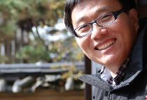

  

    <a href="/" class="site-name">Deep Learning & Life Science</a>
    <nav>
      <a href="/about/">About Taeho Jo</a>
      <a href="https://www.jolab.ai" target="_blank">JoLab.ai</a>
    </nav>
  

# About Taeho Jo (조태호)
  
안녕하세요. 머신러닝/딥러닝으로 알츠하이머를 연구하며 가끔 책도 쓰는 **조태호**라고 합니다.

- **웹사이트:** [www.jolab.ai](https://www.jolab.ai)
- **Github:** [taehojo](https://github.com/taehojo)

---

* 📓 에세이
  + 🏆 [제7회 브런치북 대상] 당신의 이유는 무엇입니까 ([책](http://www.yes24.com/Product/Goods/90981164), [브런치](https://brunch.co.kr/brunchbook/not-this-world), [애나의 다락방 라디오](https://www.youtube.com/watch?v=szHI91_ZbBU)), 어떤책, 2020
  

* 📖 IT책
  + 모두의 딥러닝 개정3판  ([코드](https://github.com/taehojo/deeplearning), [정오표](https://taehojo.github.io/book/deeplearning-20231129.pdf), [책](http://www.yes24.com/Product/Goods/108553440), [Youtube](https://www.youtube.com/@taehojo)), 길벗, 2022
  + 모두의 딥러닝 개정2판 ([코드](https://github.com/taehojo/deeplearning-for-everyone-2nd), [정오표](https://taehojo.github.io/book/errata-20220511.pdf)), 길벗, 2019 
  + 모두의 딥러닝 1판 ([코드](https://github.com/taehojo/deeplearning-for-everyone-1st)), 길벗, 2017
  + 그림으로 배우는 인지과학 ([책](http://www.yes24.com/Product/Goods/108250950)), 길벗, 2022 
  + 쉽게 시작하는 캐글 데이터 분석  ([코드](https://github.com/taehojo/getting_started_with_kaggle),[정오표](https://taehojo.github.io/book/kaggle-092322.pdf), [책](http://www.yes24.com/Product/Goods/103526120)), 길벗, 2021 
  + 딥러닝 워크북 ([코드](https://github.com/taehojo/deeplearning-workshop), [책](http://www.yes24.com/Product/Goods/59789570)), 길벗, 2018
  

* 🔬 연구 [➡️ **자세히**](https://www.jolab.ai)
  + 딥러닝을 이용한 알츠하이머 병 원인 대사체 식별 [(코드)](https://github.com/taehojo/c-SWAT), [(논문)](https://www.thelancet.com/journals/ebiom/article/PIIS2352-3964(23)00386-9/fulltext)
  + 딥러닝을 이용한 알츠하이머 병 유전 변이 식별 [(코드)](https://github.com/taehojo/SWAT), [(논문)](https://pubmed.ncbi.nlm.nih.gov/35183061/)
  + 딥러닝을 이용한 알츠하이머 병 원인 단백질 추적 [(논문)](https://bmcbioinformatics.biomedcentral.com/articles/10.1186/s12859-020-03848-0)
  + 딥러닝을 이용한 알츠하이머 병 영상 이미지를 통한 진단 [(논문)](https://www.frontiersin.org/articles/10.3389/fnagi.2019.00220/full)
  + 딥러닝을 이용한 단백질 접힘 예측 [(논문)](https://www.nature.com/articles/srep17573) 
  + 머신러닝을 이용한 단백질 접힘 예측 [(논문)](https://bmcbioinformatics.biomedcentral.com/articles/10.1186/1471-2105-15-S11-S14)
 
