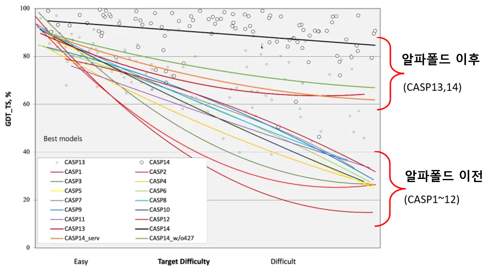

  

    <a href="/" class="site-name">blog</a>
    <nav>
      <a href="/about/">About Taeho Jo</a>
      <a href="https://www.jolab.ai" target="_blank">JoLab.ai</a>
    </nav>
  

# 알파폴드 리뷰와 해석

 

>알파폴드의 등장과 그들이 사용한 방법, 그리고 학계에 주는 의미에 관하여

 

## 알파폴드와 CASP

흥미로운 그림 하나를 가지고 왔습니다. 2020년 1월, PNAS에 실린 데이빗
베이커 그룹 논문[^1]의 결과를 설명하는 그림입니다. c부분을 보면
주황색으로 표시된 막대가 알파폴드보다 앞서 있는 것을 알 수 있습니다.
이들이 만든 trRosetta가 알파폴드를 뛰어 넘었다는 뜻입니다.

**Figure 1** 알파폴드를 분석해 만든trRosetta[^2]

흥미를 더할 만한 포인트가 몇개 더 있습니다. 2018년, 제13회 단백질 구조
예측 대회(CASP13)에 처음 등장 해 기존의 탑 그룹 결과물들을 월등한 차이로
이긴 바 있는 알파폴드가, 탑 그룹 중에서도 큰 형 격인 워싱턴대학교 베이커
교수 그룹에 의해 단 1년여 만에 따라 잡혔다는 뜻이기도 합니다. 베이커
그룹은 한발 더 나아가 trRosetta를 누구나 쓸 수 있도록 했습니다. 그러면
다가올 제14회 단백질 구조 예측 대회의 결과에도 시선이 쏠릴 수밖에
없습니다. 과연 이윤 추구를 위해 설립된 딥 마인드의 \<원조 알파폴드\>가
이길 것인지, 아니면 50여년 학계의 노하우를 가진 거장의 \<알파폴드를 뛰어
넘은 툴\>이 이길 것인지, 혹은 공개된 trRosetta를 자기만의 분야에
접목시킨 새로운 스타가 대회를 장악할 것인지.

 

**제14회 단백질 구조 예측 대회**

2020년 12월, 기다리던 제14회 단백질 구조 예측대회의 뚜껑이 열렸습니다.
그리고 사람들은 다시 한번 충격에 빠집니다.

**Figure 2** 제14회 단백질 구조 예측 대회 결과 (Average Zscore 기준)[^3]

완패입니다. 알파폴드2를 앞세워 참여한 딥마인드의 결과를 추월하기는 커녕
격차가 더 벌어 졌습니다. 이상하군요. 분명 베이커 그룹의 trRotessta는
딥마인드의 알파폴드를 앞섰었습니다. 아무리 알파폴드의 버전이 달라 졌다고
해도, 베이커 그룹의 내공도 만만치 않았을 것입니다. 그럼에도 이토록 큰
성능의 차이라니, 무언가 놓치는 부분이 있는 걸까요? 1972년 노벨상을
받으며 시작한 50여년 학계의 노하우가 이토록 크게 뒤쳐지는 이유, 그들이
결코 알파폴드를 따라잡을 수 없었던 이유에 대해서 지금부터 하나씩 풀어
보고자 합니다.

 

## 알파폴드의 원리

**알파폴드의 등장**

2018년, 단백질 구조 예측 대회에 처음 모습을 드러낸 딥마인드의 알파폴드는
모든 참가자들을 놀라게 하기에 충분했습니다. 26년째 개최되어온 단백질
구조 예측 대회에 처음 참가한 그들이 지난 수십년 간의 학문적 성과를
오롯이 담은 기존의 단백질 구조 예측 툴들을 단숨에 앞질렀기 때문입니다.

**Figure 3** 2018년 알파폴드의 첫 등장

사람들은 그들이 어떻게 했는지 궁금해했습니다. 그들의 발표에 귀를
기울였고, 논문을 기다렸습니다. 딥마인드는 자신의 노하우를 꽁꽁 숨겨두지
않았습니다. 두번의 논문을 발표했고[^4][^5] 소스 코드를 공개해[^6] 자신들의
방법에 대한 재현의 길을 터 주었습니다.

 

**알파폴드의 원리**

미지의 구조를 예측하기 위한 알파폴드의 접근 방법은 다음 그림 한장으로 요약됩니다.

**Figure 4** 알파폴드의 접근법[^5]

주목해야 하는 세가지 키워드는, 딥러닝(①), Distance Map(②) 그리고
경사하강법(③)입니다. 딥러닝(①)을 위해서 다중 서열 정렬 (MSA)을 이용했고,
학습 알고리즘으로 컨볼루션 뉴럴 네트웍(CNN)을 썼으며 그 결과는 Distance
Map(②)으로 나타납니다. 여기선 딥러닝의 이론에 대한 긴 설명은 건너
뛰겠습니다. 다만 Distance Map에 대한 설명은 필요해 보입니다. 이를
이해하는 것이 알파폴드의 방식을 이해하는데 있어서 아주 중요합니다. 예를
들어 아래는 CASP13당시 공개된 알파폴드의 Distance Map입니다.

**Figure 5** Distance Map에 대한 개념

A는 단백질의 실제 3차원 구조를 이용해 만든 Distance Map입니다. B는
컨볼루션 과정을 거쳐 예측된 Distance Map입니다. 이 A, B의 가로축과
세로축은 단백질을 이루고 있는 아미노산 서열들입니다. 두 축의 값이 서로
만나는 지점은 배열사이의 거리를 나타냅니다. 예를 들어 그림 A의 가로축에
있는 (ㄱ)과 세로축에 있는 (ㄴ)이 만나는 (ㄷ)지점은, (ㄱ)과 (ㄴ) 두 배열
사이의 거리가 색으로 표시된 것입니다. 거리가 가까울수록 색깔이 밝습니다.
단백질 3차원 입체 구조는 이렇게 해서 2차원 그림으로 표현되고, 이렇게
예측된 B그림이 실제 A그림과 유사해지도록 경사하강법(Figure 4, ③)으로
오차를 조절하는 것이 바로 알파폴드의 핵심입니다. 예측된 B그림이
실제로부터 온 A그림과 유사해지면, 두 단백질 구조는 C에서 보는 바와 같이
서로 겹쳐 놓았을 때 큰 차이가 없어 집니다. 아미노산 배열로 새로운 3차원
구조를 완성하는 것입니다.

 

**학계의 추격**

trRosseta개발 그룹도 이 눈문을 보면서 똑같이 분석했을 것입니다. 그리고
알파폴드에 보충할 만한 아이디어를 찾아보기 시작했을 것입니다. 딥마인드가
아무리 AI/딥러닝의 최고 기술을 가지고 있다고 하더라도 단백질 구조 예측을
위해 탄생한 회사는 아닙니다. 알파고로 이미 입증한 바 있는 그들의
기술력에 어떤 옷을 입힐지를 고민하던 중 단백질 구조 예측이 자신들의
기술력과 꼭 맞아 떨어진다는 것을 알게 되었을 뿐입니다. 그래서 알파폴드
논문은 필연적으로 화학자, 생물학자들의 평가를 거쳐야 했고, 피어 리뷰를
통과해 나온 결과는 이제 더 많은 전문가들을 만나 재해석 되기 시작했을
것입니다. 그렇게 자신의 렌즈로 비추어 보던 수많은 그룹 중 베이커 그룹이
한가지 아이디어를 냈습니다. 잠깐, 왜 두 배열 사이의 '거리'만 보는 거지?
두 배열 사이의 '각도'를 고려하면 더 나은 결과가 나오지 않을까? Figure
1-a에 해당하는 것이 바로 이러한 아이디어에 대한 설명입니다. 이
아이디어는 세계 최고의 실력자들로 이루어진 베이커 그룹의 연구원 들에
의해 멋지게 실현되었고 알파폴드의 기본 결과물에서 한단계 업그레이드된
결과를 내 놓습니다. 이렇게 해서 나온 결과가 바로 "알파폴드를 뛰어 넘은
툴", trRosetta였습니다.

**Figure 6** trRosetta의 성과를 보고하는 베이커 그룹 (CASP14)

 

## 따라잡지 못한 이유

하지만 이미 전술했듯, 다시 맞붙은 다음 대회에서 trRosetta를 앞세운
베이커 그룹의 결과는 알파폴드2에 크게 뒤쳐지고 맙니다. 베이커 그룹이
아무것도 잘 못하지 않았다는 것이 중요합니다. 베이커 그룹은 자신의 이전
대회 성적을 거뜬히 앞섰고, 자신이 그동안 보여준 모든 예측 결과보다도
좋은 결과를 선보였습니다. 그럼에도 불구하고 알파폴드와 너무나 큰 격차가
난 이유는 무엇일까요.

 

**두개의 흐름**

뜬금없지만, "날 때부터 부부인 사람은 없다."는 사실을 떠올려 봅니다.
각자의 부모 밑에서 서로 다른 어린 시절을 보내며, 때로 혼탁하고 지난한
홀로서기의 과정을 거친 후, 때가 되어 비로소 만나 부부가 되었을 것입니다.
알파폴드의 탄생도 어쩌면 비슷합니다. 1943년, 신경과학자 워렌 맥컬럭이
허드렛일을 하던 월터 피츠의 능력을 알아보고 그와 함께 2진법 논리회로
모델을 만든 결과[^7]는 1960년대의 퍼셉트론을 지나, 역전파를 재발견하고
딥러닝의 기초를 쌓는 제프리 힌튼에 이르러 지금의 AI, 딥러닝이 됩니다.

**Figure 7** 딥러닝의 발전 과정[^8]

다른 한편에선 아미노산 배열의 1차 구조를 처음으로 해석한 크리스천
안핀슨이 1972년 노벨상을 받은 이후 X- 선 결정학, 핵 자기 공명, 극저온
전자 현미경과 같은 실험 기술의 발달이 이어졌고, 분자 생물학, 유전학,
생명 정보학의 성과는 대규모 데이터 축척의 시대를 맞이하게 했습니다. 이
거대한 두 흐름이 맞물린 2018 년, 알파폴드가 탄생한 것입니다. 알파폴드를
만들어낸 AI와 생물학의 두 흐름은 어느 한쪽이 중요하다고 할 수 없을 만큼
모두 중요합니다. 두 흐름의 경중을 따질 수는 없다는 뜻입니다.

 **유속**

하지만 어느 쪽의 유속이 더 빠른 지를 살펴볼 필요는 있습니다. 지금 우연히
교차점에서 만나 함께 머물고 있는 두개의 흐름이지만, 그 발전 속도 마저
같다고 할 수는 없기 때문입니다. AI쪽 흐름은 유래를 찾아볼 수 없을 만큼
빠른 발전을 이루고 있습니다. 이미지 인식의 수준은 이미 사람을 넘어섰고,
자연어처리, 자율 주행, 얼굴 인식 등은 IT제품을 타고 우리 생활의 많은
부분에 커다란 영향을 끼치고 있습니다. 놀라운 것은 이 모든 변화가 2012년
제프리 힌튼 그룹의 Alexnet이 ILSVRC대회에서 경이로운 성과를 거둔 이후,
겨우 8년만에 벌어진 일들이라는 것입니다. 이러한 AI의 엄청난 발전 속도를
놓고 보면 생물학 분야의 발전은 상대적으로 느릴 수밖에 없습니다. 특히
단백질 구조 예측 분야는 제자리에 멈추어 있는 것처럼 보일 정도입니다.

예를 들어 지금으로부터 11년전인 2010년, 제가 참여했던 제9회 단백질 구조
예측대회(CASP9)의 토의 주제 중 하나가 "계속해서 이 대회를 유지해야
하는가" 였던 기억이 있습니다. 이 안건을 토의하던 좌장은 이 대회의
주최자중 한 명인 Krzysztof Fidelis였습니다. 대회의 존속을 논의해야 할
만큼 비장했던 것은, 단백질 구조 예측의 결과가 제자리 걸음인 상황을
인식하고 있었기 때문입니다. 다행히 단백질 구조 예측 대회는 없어지지
않았지만, 그 후로도 커다란 진보는 없었음이 아래 그림에서 설명되고
있습니다.

**Figure 8** 역대 단백질구조예측 대회 GDT\_TS 비교(CASP1\~14)

가로축은 단백질 구조 예측대회에 출제된 문제의 난이도를 말합니다.
세로축은 예측 결과의 정확도입니다. CASP1부터 CASP12까지, 알파폴드를
만나기 전의 단백질 구조 예측 분야는 발전 속도가 매우 더디었음이
드러납니다. 이정도면 알파폴드 덕분에 오히려 단백질 구조 예측 대회가
세간의 주목을 다시 받았다고 할 수 있을 정도입니다. 단백질 구조 예측
분야는 딥러닝을 만난 후에야 획기적인 전환점을 맞이한 것입니다.

 

**따라잡을 수 없었던 이유**

다시 질문으로 돌아가 보겠습니다. 학계는 최선을 다해 자신의 영역안에서
알파폴드의 부족한 점을 채웠는데 왜 따라잡지 못했는가? 어쩌면 답은 질문
안에 있을지도 모릅니다. 학계가 최선을 다해 자신의 영역을 고수했다는 것은
결국 학계는 최선을 다해 자신의 영역에 머물렀다는 뜻이기 때문입니다.

학문의 특성상 화학적, 생물학적 지식은 짧은 시기에 "폭발적"으로 발전할
만한 것이 아닙니다. AI와 다른 점입니다. 다시 말해, Cβ-Cβ의 Distance에 d,
ω, θ, φ각도를 더하는 베이커 그룹의 노력은, CNN을 과감히 버리고 AI의
흐름에 발맞추어 Transformer와 Attention을 도입한 알파폴드2를 결코
따라잡을 수 없다는 것입니다.

**Figure 9** CNN과 Transformer의 model architecture [^9] [^10]

알파폴드는 16개의 TPUv3 (대략 100-200개의 GPU)로 3\~4주 정도 학습을
했다고 발표했습니다. 물론 짧은 학습은 아니지만, 업계의 일반적인 규모를
생각해 보면 특별히 길다고 할 수도 없습니다. 사실 그들이 PDB, Uniprot로
부터 "공짜로" 가져가 쓴 학습용 데이터들이 50여년을 이어온 오랜 노력의
결과물이라는 점을 생각해 보면, 3\~4주의 학습 시간은 그저 순간처럼 느껴질
정도입니다. 게다가 이는 학계의 대가나 노벨상 수상자가 아닌, 그저
딥러닝으로 하면 "된다"는 것을 확신하는 몇몇 사람들이 모여 이룬 것입니다.
그렇다면 이렇게 물어보고 싶기도 합니다. 단지 3\~4주 학습하면 이룰 만한
것이 바로 옆에 있었는데, 50년간 공부해 오던 이들은 어째서 이를 모르고
있었는지 말입니다.

 

## 활짝 열린 문

시대가 바뀌고 있고 세상이 변하고 있습니다. 학문의 경계 안에서 그동안
평가의 잣대로 사용되던 기준이 변하고 있고 나의 영역을 고수하는 것이
오히려 나를 그 안에 가두어 놓는 시대를 살고 있습니다. 이제 내 영역 안에
딥러닝이라는 툴을 가져와 쓰는 것을 넘어, 딥러닝을 제대로 알고 AI를
공부해서 기존의 영역을 다시 점검해야 할 때가 찾아왔습니다.

아직 기회는 문을 열어 놓고 우리를 기다리고 있습니다. 알파폴드는 결코
뛰어난 사람들이 천재적인 기술로 만든, 범접할 수 없는 소프트웨어가
아닙니다. 속을 뜯어보니 결국 누군가 해 놓은 CNN알고리즘(버전1)과
Transformer알고리즘(버전2)에 학자들이 오랜 기간 만들어 놓은 공개
데이터(Uniprot, PDB)를 가져와 쓴 결과입니다. 이제 와서 보니 그들은
Cβ-Cβ의 거리와 함께 '각도'를 잴 수 있다는 것도 생각을 못했습니다. 그런데
그들이 만든 알파폴드는 단백질 구조 예측에 평생을 바친 단백체학, 구조
생물학 전공자들을 단숨에 얼어붙게 만드는 파괴력을 선보이고 있습니다.
그렇다면 알파폴드는 AI의 흐름이 생각보다 단단하고 거대하다는 경고로
보아야 할 것입니다. 수십년간 쌓아온 견고한 학문의 성 마저도 어느 순간
단숨에 무너질 수 있다는 메시지인 것입니다.

여전히 AI시대의 초입이라는 건 좋은 소식입니다. 지금은 딥러닝을 쉽게 배울
수 있는 때입니다. 필요한 대부분이 라이브러리로 준비되어 있고, 깃허브에는
잘된 소스코드가 공유되어 있습니다. 연구와 학문의 길을 걷는 사람이라면,
자신의 분야에 그동안 쏟아 부은 에너지의 작은 부분만으로도 AI라는 거인의
어깨에 올라탈 수 있습니다. 자리를 털고 일어나기만 하면 됩니다. 제자리에
머무는 것이 아니라, AI를 나의 무기로 삼고 그들의 어깨에 올라타 세상을
향해 뛰어나가야 할 때입니다. 변화의 시기는 이미 찾아왔습니다. 그게 어떤
분야이든, "알파폴드"의 다음 영광은 거대한 변화의 흐름을 읽고 미리
준비하는 이들의 차지가 될 것입니다.

 

**조태호** (인디애나대학교 의과대학)

  

> 이 글은 "[물리학과 첨단기술](https://webzine.kps.or.kr/?p=5_view&idx=16537)" (2021년 3월 30권 3호), "[크로스로드](http://crossroads.apctp.org/myboard/read.php?Board=n9998&id=1667)" (2021년 3월 통권 186호)에 실린 **[알파플드 사태의 재해석: 그들의 착각에 대한 보고서 - 조태호]**를 재구성 한 것 입니다. 

 

---

\<참고자료\>

[^1]: Yang, Jianyi, et al. \"Improved protein structure prediction using predicted interresidue orientations.\" Proceedings of the National Academy of Sciences 117.3 (2020): 1496-1503.

[^2]: http://fold.it/portal/node/2008706

[^3]: https://predictioncenter.org/casp14/zscores_final.cgi

[^4]: Senior, Andrew W., et al. \"Protein structure prediction using multiple deep neural networks in the 13th Critical Assessment of Protein Structure Prediction (CASP13).\" Proteins: Structure, Function, and Bioinformatics 87.12 (2019): 1141-1148.

[^5]: Senior, Andrew W., et al. \"Improved protein structure prediction using potentials from deep learning.\" Nature 577.7792 (2020): 706-710.

[^6]: https://github.com/deepmind/deepmind-research/tree/master/alphafold_casp13

[^7]: 조태호, "모두의 딥러닝", 길벗(2020)

[^8]: deepkapha.ai

[^9]: Jo, Taeho, Kwangsik Nho, and Andrew J. Saykin. \"Deep learning in Alzheimer\'s disease: diagnostic classification and prognostic prediction using neuroimaging data.\" Frontiers in aging neuroscience 11 (2019): 220.

[^10]: Vaswani, Ashish, et al. \"Attention is all you need.\" arXiv preprint arXiv:1706.03762 (2017).

[^11]: Jo, Taeho, et al. \"Improving protein fold recognition by deep learning networks.\" Scientific reports 5.1 (2015): 1-11.

 
