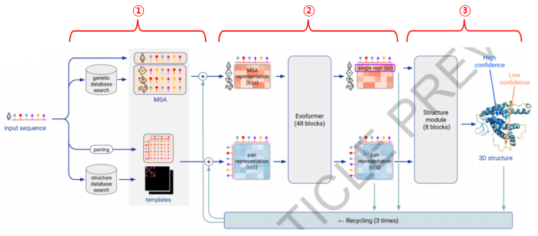
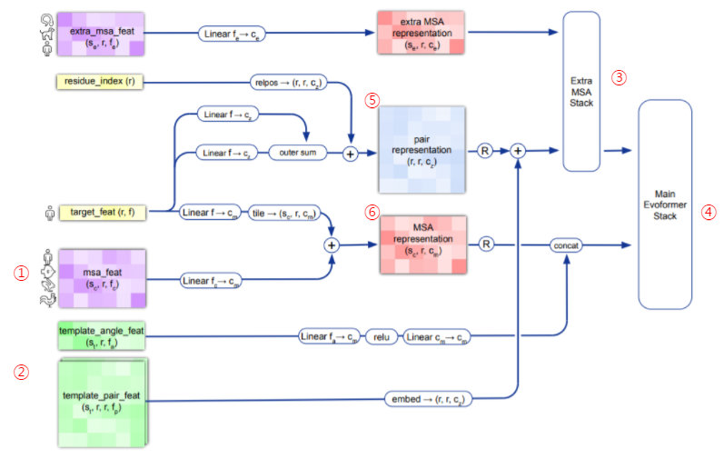
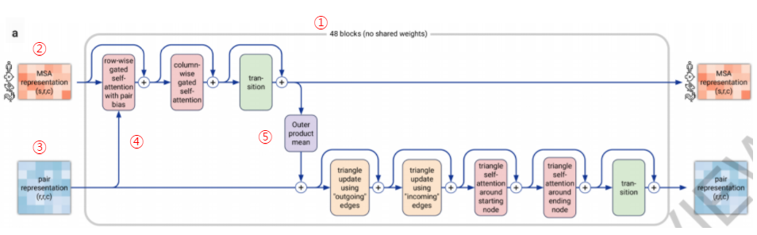
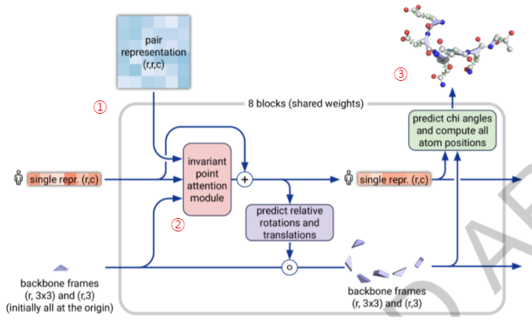

# 알파폴드2 모델 분석

 
> 2021년 7월 15일, 네이처지[^1]에 발표된 알파폴드2 논문의 내용 중,  알파폴드2가 작동하는 흐름에 초점을 두고 요약되었습니다.  

 

## 알파폴드2의 작동 원리

**Figure 1**. 알파폴드2의 model architecture

이 그림은 알파폴드2의 처리 과정을 한눈에 보여줍니다. 알파폴드2는 다음의 3가지 스텝으로 구성되어 있습니다. 먼저 입력 데이터를 전처리하는 Input feature embeddings(Figure 1-①) 단계, 어텐션 학습을 통해 전처리된 데이터에서 필요한 정보를 뽑아내는 Evoformer(Figure 1-②)단계, 그리고 여기서 나온 정보를 구체적인 3차원 좌표로 처리하는 Structure module(Figure 1-③)단계입니다.

 

## 1. Input feature embeddings 

**Figure 2**. Input feature embeddings

 알파폴드2의 첫 단계는 알파폴드1과 마찬가지로 입력 시퀀스를 전처리 하는 단계입니다. 먼저 유전자 데이터베이스에서 유사한 evolutionary 서열을 검색하여 다중 서열 정렬(MSA)을 생성합니다(Figure 2-①). 170,000개의 PDB 데이터, Uniprot의 대규모 데이터베이스를 이용했으며, JackHMMER와
HHblits를 이용해서 UniRef90, MGnify clusters, BFD를 검색하는 방식을 썼습니다. 여기까지는 알파폴드1과 비슷합니다. 알파폴드2는 여기에 추가로 쿼리 시퀀스와 유사한 시퀀스 부분을 가진, 알려진 단백질 템플릿을 검색합니다(Figure 2-②). 이를 위해 HHSearch를 통해 PDB70 clustering에서 잠재 템플릿 검색했습니다.

만일 거의 완벽한 템플릿이 존재한다면, 이를 통해 기존의 방식대로 구조예측을 마무리 할 것입니다. 하지만 알파폴드2가 기존의 Yang Zhang 랩이나 David Baker랩을 뛰어 넘을 수 있었던 건 시퀀스 정보에서
필요한 정보를 추가하는 Extra MSA Stack(Figure 2-③), Evoformer Stack(Figure 2-④)과정이 있다는 것입니다. 이를 위해 입력 시퀀스로 부터 얻은 다중 시퀀스 정렬(MSA) 과 템플릿 구조를 Pair representation(Figure 2-⑤)과 MSA representation(Figure 2-⑥)으로 통합해 다음 단계를 준비합니다.

많은 입력 데이터를 가지기 때문에, 이 사전 처리 과정을 수차례 반복하고, 여러 버전의 Pair representation과 MSA representation을 만들어 평균값을 구해 다음 단계로 보내며, self-destination이라는 방법을 사용해서 기존의 훈련 데이터이외의 pdb 파일을 훈련에 포함했다고 합니다. 즉, 현재 구조가 알려진 모든 pdb파일을 훈련 데이터로 사용하고, 여기에 구조가 알려지지 않은
시퀀스로 약 300,000여개의 구조를 예측한 후 이중 높은 정밀도로 예측했다고 판단되어 지는 것을 다시 훈련 데이터로 사용하는 방법을 써서 학습데이터를 확장했습니다.

 

## 2. Evoformer 

Pair representation과 MSA representation이 만들어지면 이 정보는 Evoformer단계로 넘어갑니다.

**Figure 3**. Evoformer block

주어진 Pair representation과 MSA representation을 개선하기 위해 어텐션 메커니즘의 48개 레이어로 구성된 deep tranformer-like 네트워크(Figure 3-①)가 적용되는 단계입니다.

48개의 모든 레이어에는 각각 개별 매개변수가 있으며 입력과 출력은 MSA representation과 Pair representation입니다.

Evoformer 안에는 두개의 흐름이 있는데, 하나는 MSA representation이 입력되어 진행되는 흐름으로 Figure 3상에서 위쪽의 흐름입니다(Figure 3-②). 또 하나는 Pair representation(Figure 3-③)의 정보 흐름입니다. 이 두 흐름의 아이디어는 기본적으로 단백질의 공간적, 진화적 관계에 대한 직접적인 추론을 가능하게 하는 정보를 교환하게 하는 것, 네트워크 내부에서 MSA representation 및 pair representation의 정보가 반복적으로 개선되게 하는 것입니다. 

예를 들어 특정 단백질에 대한 mutation의 evolutionary trajectory에 대한 정보를 포함하는 MSA의 정보가 조금 더 정확해 지려면 처리 중인 구조에 대해 알아야 하는데, 이 정보를 Pair representation을 통해 얻습니다. Pair representation의 정보가 MSA 스택으로 흐르도록 하고 (Figure 3-④) MSA representation 흐름은 점차 Pair representation쪽으로 재차 이동합니다(Figure 3-⑤). 즉, 두 가지 정보 흐름은 입력 단백질에 대한 진화적 퍼즐을 풀기 위해 함께 상호 작용하게 되는 구조입니다. 관련 없는 mutual information 이나 pseudolikelihood등의 pairwise co-evolution features들이 이 과정을 통해 무시됨으로써 더 나은 정보를 MSA에서 얻는 구조입니다.

 

## 3. Structure module 

Evoformer단계에서 만들어진 정보는 protein geometry의 구체적인 3차원 좌표로 변환하는 Structure module단계로 넘어옵니다.

**Figure 4**. Structure Module

Evoformer가 가지고 있는 정보는 2D representation 형태로, 반드시 3차원 단백질 기하학으로 변환되어야 합니다. 이는 weight을 공유하는 8개의 RNN 블록에서 수행됩니다. Evoformer의 최종 MSA representation 정보와 Pair representation 정보가 사용되며, distances, torsions, atom coordinates, Cα-lDDT의 추정치를 예측하게 됩니다. 아직 3D좌표가 없는 상태이므로 초기 상태는 단백질의 모든 잔기가 동일한 지점에 위치하며 동일한 방향을 갖게 배치됩니다. 이것을 \'블랙홀 초기화\'라고 부르고 이제 이 때 형성된 Residue gas가 두 단계를 통해 반복적으로 업데이트됩니다. 첫번째 단계는, Invariant Point Attention 또는 IPA라고 하는 연산을 사용하여 3D 위치를 변경하지 않고 시퀀스 representation을 업데이트하는 단계입니다(Figure 4-①). 두번째 단계는 업데이트된 시퀀스 representation을 사용하여 Residue gas에 대해 equivariant 업데이트를 수행하는 단계입니다(Figure 4-②).

Invariant Point Attention 메커니즘에는 단백질 구조 개선을 위해 특별히 설계된 여러가지 기술이 포함되어 있습니다. 이중 하나가 시퀀스 표현과 백본 변환을 반복적으로 업데이트함으로써 단백질의 블랙홀 초기화가 최종 백본 기하학이 나타날 때까지 점진적으로 조정되게 하는 것입니다. 이것은 단백질 구조를 spatial graph로 인식하고 이 graph를 추적하기 위해 각 residue들을 node로 취급, 물리적 상호 작용을 추론하는 과정이며 이러한 과정을 통해 기존의 딥러닝 방법이 글로벌 구조를 정확하게 설명하지 못했던 단점을 극복할 수 있었다고 합니다. 

마지막에 Resnet이 추가되어 side chain의 모든 원자에 대한 비틀림 각도를 예측합니다. 여기서 단백질 구조의 모든 원자에 대한 3차원 좌표로 이어집니다(Figure 4-③). 출력 단계에서 얻은 per-residue lDDT 점수를 사용해 매우 확실한 예측 위치와 그렇지 않은 위치를 판단하게 됩니다. 원자 좌표가 충돌할 수 있는 가능성을 배제하기 위해 OpenMM의 Amber ff99SB force field를 사용하여 최종적으로 restrained energy minimization 과정을 거치게 됩니다.

 

## 마치며

알파폴드는 CASP14에서 0부터 100까지의 범위를 가지는 GDT점수(100이 만점)에서 median score 92.4점을 얻었습니다. 이는 약 1.6 Angstroms의 평균 오차(RMSD)를 가진다는 의미인데, 곧 원자의 너비 (0.1 나노 미터)와 비슷한 수준입니다. Free-modelling 카테고리의 가장 어려운 예측 타겟들도 median score 87.0의 GDT값을 달성했습니다.

결론적으로 Attention-based neural network을 통해 End-to-end 방식으로 학습했다고 할 수 있으나, 이러한 간단한 설명으로는 턱없이 부족할 만큼 획기적인 아이디어들이 적재 적소에 사용된 혁신적인 시스템이라는 생각입니다. 이 글에 소개된 분석은 핵심적인 것들만 추린 것이므로 자세한 내용은 논문과 supplement 파일을 반드시 읽어 보셔야 합니다.

1972년 아미노산 배열의 1차 구조가 처음으로 해석된 이래, 단백질의 구조를 알아내기 위한 노력이 계속되어 왔습니다. 그동안 X- 선 결정학, 핵 자기 공명, 극저온 전자 현미경과 같은 실험 기술의 발달이 이어졌지만, 시간과 비용이 커서 아미노산 배열만 가지고 3차원 구조를 알아내려는 수많은 시도가 있었습니다. 알파폴드2는 지난 50여년간 이어온 분자 생물학, 유전학, 생명정보학의 성과가 AI의 급속한 발전과 더불어 탄생한 놀라운 사건이 아닐 수 없습니다. 알파폴드2가 바꾸게 될 많은 것들을 기대하며 리뷰를 마칩니다.

 

**조태호** (인디애나대학교 의과대학)

 
 

----

[^1]: https://www.nature.com/articles/s41586-021-03819-2

