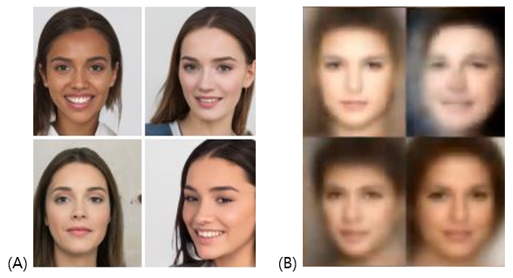
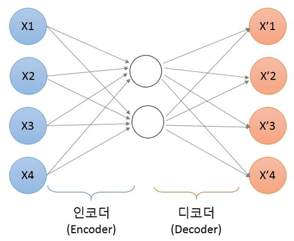
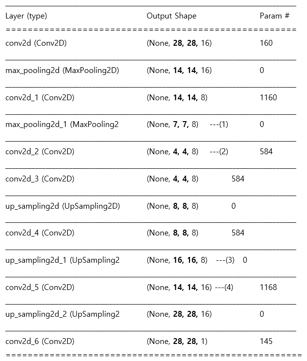
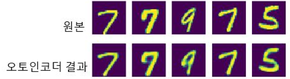

# 쉽게 이해하는 오토인코더

 [](https://bit.ly/taehojo)

딥러닝을 이용해 가상의 이미지를 만드는, 또 하나의 유명한 알고리즘이 있습니다. **오토인코더**(Auto-encoder, AE)입니다. 

오토인코더는 GAN과 비슷한 결과를 만들지만, 다른 성질을 가지고 있습니다. GAN이 세상에 존재하지 않는 완전한 가상의 것을 만들어 내는 반면, 오토인코더는 입력 데이터에 특징을 효율적으로 담아낸 이미지를 만들어 냅니다. 예를 들어GAN으로 사람의 얼굴을 만들면 진짜 같아 보여도 실제로는 존재하지 않는 완전한 가상의 이미지가 만들어집니다. 하지만, 오토인코더로 만든 사람의 얼굴은 초점이 좀 흐릿하고 윤곽이 불명확하지만 사람의 특징을 유추할 수 있는 것들을 모아 만들어집니다. (Figure 1)



**Figure 1**. (A) GAN으로 만든 이미지, (B) 오토인코더로 만든 이미지. 


오토인코더는 영상 의학 분야 등 아직 데이터 수가 충분하지 않은 분야에서 사용될 수 있습니다. 학습 데이터는 현실 세계의 정보를 담고 있어야 하므로, 세상에 존재하지 않는 가상의 것을 집어넣으면 예상치 못한 결과를 가져올 수 있습니다. 하지만 데이터의 특징을 잘 담아내는 오토인코더라면 다릅니다. 부족한 학습 데이터 수를 효과적으로 늘려주는 효과를 기대할 수 있지요. 

 

오토인코더의 학습은 GAN의 학습보다 비교적 이해하기 쉽습니다. 오토인코더의 원리를 그림으로 표현하면 다음과 같습니다.  




 

**Figure 2**. 오토인코더의 구조. 입력 값(X)와 출력 값(X’) 사이에 차원이 작은 노드가 포함됨

입력한 이미지와 똑같은 크기로 출력 층을 만들었습니다. 입력 층보다 적은 수의 노드를 가진 은닉층을 중간에 넣어 줌으로써 차원을 줄여 줍니다. 이때 소실된 데이터를 복원하기 위해 학습을 시작하고, 이 과정을 통해 입력 데이터의 특징을 효율적으로 응축한 새로운 출력이 나오는 원리입니다. 

 

가장 핵심이 되는 인코딩과 디코딩 과정을 먼저 코딩해 보면 다음과 같습니다.

 

```
#생성자 모델 만들기
autoencoder = Sequential() 
 
#인코딩 파트
autoencoder.add(Conv2D(16, kernel_size=3, padding='same', input_shape=(28, 28, 1), activation='relu'))  ---(1)
autoencoder.add(MaxPooling2D(pool_size=2, padding='same'))  ---(2)
autoencoder.add(Conv2D(8, kernel_size=3, activation='relu', padding='same'))  ---(3)
autoencoder.add(MaxPooling2D(pool_size=2, padding='same'))  ---(4)
autoencoder.add(Conv2D(8, kernel_size=3, strides=2, padding='same', activation='relu'))  ---(5)

# 디코딩 파트
autoencoder.add(Conv2D(8, kernel_size=3, padding='same', activation='relu'))   ---(6)
autoencoder.add(UpSampling2D())   ---(7)
autoencoder.add(Conv2D(8, kernel_size=3, padding='same', activation='relu'))   ---(8)
autoencoder.add(UpSampling2D())   ---(9)
autoencoder.add(Conv2D(16, kernel_size=3, activation='relu'))   ---(10)
autoencoder.add(UpSampling2D())   ---(11)
autoencoder.add(Conv2D(1, kernel_size=3, padding='same', activation='sigmoid'))   ---(12)

# 전체 구조 확인
autoencoder.summary()   ---(13)
```

(1)~(5)는 입력된 값의 차원을 축소시키는 **인코딩** 파트이고 (6)~(12)는 차원을 점차 다시 늘려 입력 값과 똑같은 크기의 출력 값을 내보내는 **디코딩** 파트입니다. 두 파트가 하나의 **Sequential()** 함수로 쭉 이어져 autoencoder모델을 만듭니다. 

 

인코딩 파트에서 입력 크기를 줄이는 방법으로 **MaxPooling()**을 사용했습니다((2), (4)). 반대로 디코딩 파트에서는 크기를 늘리기 위해서 **UpSampling()**을 썼습니다((7), (9), (11)). 

 

여기서 놓치지 말아야 할 것은 (1)에서 입력된 28x28 크기가 레이어를 지나면서 어떻게 바뀌는지를 파악하는 것입니다. 입력된 값은 MaxPooling 레이어 (2), (4)를 지나면서 절반씩 줄어들 것이고, Upsampling 레이어 (7), (9), (11)을 지나면서 두 배로 늘어납니다. 

그렇다면 이상한 점이 하나 있습니다. 어째서 MaxPooling레이어는 두 번이 나오고 Upsampling 레이어는 세 번이 나올까요? 이대로라면 처음 입력된 28x28 보다 더 큰 크기가 출력되는 것 아닐까요?

 

해답은 (10) 레이어에 담겨 있습니다. 잘 보면 padding 옵션이 없습니다. 크기를 유지시켜 주는 padding 과정이 없으므로 마스크가 적용되면서 크기가 줄어드는 것입니다. 이를 다시 확인하기 위해 전체 구조를 확인해 보면(13) 다음과 같습니다. 




(3)에서 (4)로 넘어갈때 다른 Conv2D 레이어와 달리 벡터 값이 줄어들었음에 주의합니다. (4)의 Conv2D 레이어에는 padding이 적용되지 않았고 kernel size =3이 설정되었으므로 3x3 마스크가 훓고 지나가며 벡터의 차원을 2만큼 줄게 했습니다.

 

한 가지 더 눈여겨 보아야 할 부분은, (1)에서 (2)로 넘어갈 때입니다. 차원을 절반으로 줄여 주는 MaxPooling이 적용되어야 하는데 2로 나눌 수 없는 7개의 벡터 값이 있습니다. 이럴 때는 padding이 적용되어 빈자리를 0으로 채워 줍니다. 이로 인해 (2)의 값이 4가 되었습니다. 

 

마지막 레이어의 벡터 값이 처음 입력 값과 같은 28x28 크기가 되는 것을 확인하면 모든 준비가 된 것입니다. 


이를 사용해 오토인코더를 완성하면 다음과 같습니다. 

**오토인코더 실습하기**

```
from tensorflow.keras.datasets import mnist
from tensorflow.keras.models import Sequential, Model
from tensorflow.keras.layers import Input, Dense, Conv2D, MaxPooling2D, UpSampling2D, Flatten, Reshape
import matplotlib.pyplot as plt

# MNIST데이터 셋을 호출
(X_train, _), (X_test, _) = mnist.load_data()
X_train = X_train.reshape(X_train.shape[0], 28, 28, 1).astype('float32') / 255
X_test = X_test.reshape(X_test.shape[0], 28, 28, 1).astype('float32') / 255

# 생성자 모델 만들기
autoencoder = Sequential()

# 인코딩 부분
autoencoder.add(Conv2D(16, kernel_size=3, padding='same', input_shape=(28,28,1), activation='relu'))
autoencoder.add(MaxPooling2D(pool_size=2, padding='same'))
autoencoder.add(Conv2D(8, kernel_size=3, activation='relu', padding='same'))
autoencoder.add(MaxPooling2D(pool_size=2, padding='same'))
autoencoder.add(Conv2D(8, kernel_size=3, strides=2, padding='same', activation='relu'))

# 디코딩 부분
autoencoder.add(Conv2D(8, kernel_size=3, padding='same', activation='relu'))
autoencoder.add(UpSampling2D())
autoencoder.add(Conv2D(8, kernel_size=3, padding='same', activation='relu'))
autoencoder.add(UpSampling2D())
autoencoder.add(Conv2D(16, kernel_size=3, activation='relu'))
autoencoder.add(UpSampling2D())
autoencoder.add(Conv2D(1, kernel_size=3, padding='same', activation='sigmoid'))

# 전체 구조 확인
autoencoder.summary()

# 컴파일 및 학습을 하는 부분
autoencoder.compile(optimizer='adam', loss='binary_crossentropy')
autoencoder.fit(X_train, X_train, epochs=50, batch_size=128, validation_data=(X_test, X_test))

# 학습된 결과를 출력하는 부분
random_test = np.random.randint(X_test.shape[0], size=5)  # 테스트할 이미지를 랜덤으로 호출.
ae_imgs = autoencoder.predict(X_test)  # 앞서 만든 오토인코더 모델에 집어넣이기

plt.figure(figsize=(7, 2))  # 출력될 이미지의 크기를 정하기

for i, image_idx in enumerate(random_test):    # 랜덤으로 뽑은 이미지를 차례로 나열
   ax = plt.subplot(2, 7, i + 1)
   plt.imshow(X_test[image_idx].reshape(28, 28))  # 테스트할 이미지를 먼저 그대로 보여줌
   ax.axis('off')
   ax = plt.subplot(2, 7, 7 + i +1)
   plt.imshow(ae_imgs[image_idx].reshape(28, 28))  # 오토인코딩 결과를 다음 열에 입력
   ax.axis('off')
plt.show()
```


**실행 결과**



 

첫 번째 라인이 테스트로 사용된 원본 이미지, 두 번째 라인이 원본의 특징을 고스란히 담은 채 만들어진 오토인코더의 결과입니다. 

 

<br/>

Copyright : **조태호** 

(본 내용을 허락없이 사용하시면 안됩니다.)

[](https://github.com/taehojo)
[](https://facebook.com/taehojo)
[](https://medicine.iu.edu/faculty/41882/jo-taeho)
<br/>

<br/>

[](https://bit.ly/taehojo)

[](http://www.yes24.com/Product/Goods/108553440)

👉책으로 보시려면 [예스24](http://www.yes24.com/Product/Goods/108553440), [교보문고](http://www.kyobobook.co.kr/product/detailViewKor.laf?mallGb=KOR&ejkGb=KOR&linkClass=&barcode=9791165219246), [알라딘](https://www.aladin.co.kr/shop/wproduct.aspx?ISBN=K662837474) 

