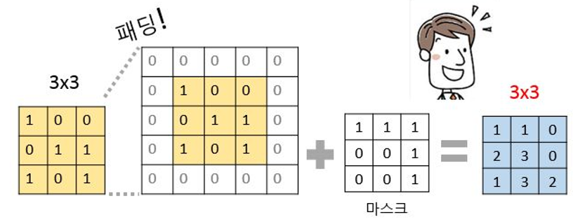

# 쉽게 이해하는 GAN

[](https://bit.ly/taehojo)

 

세계 각국에서 살아가는 다양한 인종, 성별의 사진을 보여드리고 있습니다. 그런데 아무도 위 사진 속 사람들을 직접 만난 적은 없습니다. 세상에 존재하는 이들이 아니기 때문입니다. 모두 딥러닝이 만들어 낸 가상의 얼굴입니다. 

----

**생성적 적대 신경망**(Generative Adversarial Networks), 줄여서 ‘**GAN**’이라고 부르는 알고리즘을 이용해 만든 것들이지요. GAN은 딥러닝의 원리를 활용해 가상의 이미지를 생성하는 알고리즘입니다. 예를 들어 얼굴을 만든다면, 이미지 픽셀들이 어떻게 조합되어야 우리가 생각하는 '얼굴'의 형상이 되는지를 딥러닝 알고리즘이 예측한 결과가 위에 나온 이미지들입니다. 

 

GAN이라는 이름에는 **적대적**(서로 대립 관계에 있는, Adversarial)이란 단어가 들어가 있는데, 이것이 GAN 알고리즘의 성격을 잘 말해 줍니다. 진짜 같은 가짜를 만들기 위해 GAN 알고리즘 내부에서는 ‘적대적’인 경합 과정이 진행되기 때문입니다. 이 적대적인 경합을 쉽게 설명하기 위해 GAN의 아이디어를 처음으로 제안한 이안 굿펠로(Ian Goodfellow)는 그의 논문에서 위조지폐범과 경찰의 예를 들었습니다. 진짜 지폐와 똑같은 위조지폐를 만들기 위해 애쓰는 위조지폐범과 이를 가려내기 위해서 노력하는 경찰 사이의 경합이 결국 더 정교한 위조지폐를 만들어 낸다는 것이지요. 한쪽은 가짜를 만들고 한쪽은 진짜와 비교하는 경합의 과정을 이용하는 것이 바로 GAN의 원리입니다. Figure 1은 GAN의 이러한 과정을 설명하고 있습니다.


**Figure 1**. 생성자는 판별자가 구별할 수 없을 만큼 정교한 가짜를 만드는게 목표!


가짜를 만들어 내는 파트를 ‘생성자(Generator)’, 진위를 가려내는 파트를 ‘판별자(Discriminator)’라 부릅니다. 이러한 기본 구조 위에 여러 아이디어를 더한 GAN의 변형 알고리즘들이 지금도 계속해서 발표되고 있습니다. 페이스북의 AI 연구팀이 만들어 발표한 ‘**DCGAN**(Deep Convolutional GAN)’도 그중 하나입니다. DCGAN은 컨볼루션 신경망(CNN)을 GAN에 적용한 알고리즘인데, GAN을 지금의 GAN이 되게끔 해 주었다고 해도 과언이 아닐 만큼, 불안정하던 초기의 GAN을 크게 보완해 주었습니다. 지금부터 이 DCGAN을 직접 만들어 보고 그 원리를 공부해 보겠습니다. 


## 1. 가짜 제조 공장, 생성자

 

**생성자**(Generator)는 가상의 이미지를 만들어 내는 공장입니다. 처음엔 랜덤한 픽셀 값으로 채워진 가짜 이미지로 시작해서 판별자의 판별 결과에 따라 지속적으로 업데이트하며 점차 원하는 이미지를 만들어 갑니다. 

 

DCGAN은 생성자가 가짜 이미지를 만들 때, 컨볼루션 신경망(CNN)을 이용한다고 했습니다. DCGAN에서 사용되는 컨볼루션 신경망은 일반적인 것과 조금 차이가 있습니다. 먼저 optimizer를 사용하는 최적화 과정이나 컴파일하는 과정이 없습니다. 판별과 학습이 이곳 생성자에서 일어나지 않기 때문입니다. 

 

또한, 일부 매개 변수를 삭제하는 풀링(pooling) 과정이 없고, 대신 입력 크기와 출력 크기를 똑같이 맞추기 위해서 빈곳을 채워 같은 크기로 맞추는 **패딩**(padding) 과정이 포함됩니다. 

**패딩**

패딩 과정이 필요한 이유는 아래 Figure 2를 통해 알수 있습니다. 


**Figure 2**. 생성자에서 입력된 이미지는 마스크를 거치며 마스크의 크기로 줄어든다. 

마스크를 이동하며 컨볼루션 레이어를 만들면 이미지의 크기가 처음보다 줄어듭니다(Figure2에서는 3x3에서 2x2로 변하는 과정을 보여주고 있습니다.). 그런데 판별자 파트에서 비교 될 '진짜' 이미지는 처음과 같은 3x3입니다. 예를 들어 MNIST 손글씨 인식 데이터는 모두 가로 세로가 28x28입니다. 이 데이터를 사용해 GAN을 수행한다면 입력 이미지와 판별자 이미지가 모두 가로 28 X 세로28 픽셀의 크기가 되어야 하는데 중간에 마스크를 통해 사이즈가 줄어들면 생성자의 이미지와 판별자의 이미지를 비교할 수 없게 됩니다.    

**케라스**의 패딩 함수는 이러한 문제를 처리할 수 있도록 도와줍니다. padding=’same’ 이라는 설정을 통해 입력과 출력의 크기가 다를 경우 자동으로 확장해 주고, 확장된 공간에 0을 채워 넣을 수 있습니다




 **Figure 3**. 패딩을 이용하면 마스크를 거친 후에도 차원이 변하지 않는다!


**배치 정규화**

패딩 외에도 알아야 할 것들이 몇 가지 더 있습니다. DCGAN의 제안자들은 학습에 꼭 필요한 옵션들을 제시했는데, 그중 하나가 **배치 정규화**(Batch Normalization)라는 과정입니다. 배치 정규화란 입력 데이터의 평균이 0, 분산이 1이 되도록 재배치하는 것인데, 다음 레이어로 입력될 값을 일정하게 재배치하는 역할을 합니다. 이 과정을 통해 레이어의 개수가 늘어나도 안정적인 학습을 진행할 수 있습니다. 케라스는 이를 쉽게 적용할 수 있게끔 BatchNormalization() 함수를 제공합니다. 

 

또한 생성자의 활성화 함수로는 ReLU() 함수를 쓰고 판별자로 넘겨 주기 직전에는 tanh() 함수를 쓰고 있습니다. tanh() 함수를 쓰면 출력되는 값을 -1~1사이로 맞출 수 있습니다. 판별자에 입력될 MNIST손글씨의 픽셀 범위도 -1~1로 맞추면 판별 조건이 모두 갖춰집니다. 

 

- 지금까지 설명한 내용을 코드로 정리하면 다음과 같습니다. 


```
generator = Sequential() # 모델 이름을 generator로 정하고 Sequential() 함수를 호출
generator.add(Dense(128 * 7 * 7, input_dim=100, activation='relu')) ---(1)
generator.add(Reshape((7,7,128)))  ---(2)
generator.add(UpSampling2D())  ---(3)
generator.add(Conv2D(128, kernel_size=3, padding='same'))  ---(4)
generator.add(BatchNormalization())  ---(5)
generator.add(Activation('relu'))  ---(6)
generator.add(UpSampling2D())  ---(7)
generator.add(Conv2D(64, kernel_size=3, padding='same'))  ---(8)
generator.add(BatchNormalization())  ---(9)
generator.add(Activation('relu'))  ---(10)
generator.add(Conv2D(1, kernel_size=3, padding='same', activation='tanh'))  ---(11)
```


**코드 설명** 

먼저 (1)부터 차례로 확인해 보겠습니다. 

```
Dense(128 * 7 * 7, input_dim=100, activation='relu')  ---(1)
```

여기서 128은 임의로 정한 노드의 수 입니다. 충분한 노드를 마련해주면 됩니다. Input_dim=100은 100차원 크기의 랜덤 벡터를 준비해 집어넣으라는 뜻입니다. 꼭 100이 아니어도 좋습니다. 적절한 숫자를 임의로 넣어주면 됩니다.

주의할 부분은 7*7입니다. 이는 이미지의 최초 크기를 말합니다. MNIST 손글씨 이미지의 크기는 28x28인데, 왜 7x7크기의 이미지를 넣어줄까요? 

(3), (7)을 보면 답이 있습니다. UpSampling2D() 함수를 사용했습니다. UpSampling2D() 함수는 이미지의 가로, 세로 크기를 2배씩 늘려줍니다. 7x7이 (3) 레이어를 지나며 그 크기가 14x14가 되고, (7) 레이어를 지나며 28x28이 되는 것입니다. 

이렇게 작은 크기의 이미지를 점점 늘려 가면서 컨볼루션 레이어((4), (8))를 지나치게 하는 것이 DCGAN의 특징입니다(케라스는 Upsampling과 Conv2D를 합쳐 놓은 Conv2DTranspose() 함수도 제공합니다. (3), (4)와 (7), (8)을 각각 없애고 이 함수 하나만 써도 되는데, 여기서는 이해를 돕기 위해 두 개로 나누어 쓰고 설명합니다).

```
generator.add(Reshape((7,7,128)))  ---(2)
```

(2)는 컨볼루션 레이어가 받아들일 수 있는 형태로 바꾸어 주는 코드입니다. Conv2D() 함수의 input_shape 부분에 들어갈 형태로 정해 줍니다.

```
generator.add(UpSampling2D())  ---(3)
generator.add(Conv2D(128, kernel_size=3, padding='same'))  ---(4)
```

(3), (4) (그리고 (7), (8))는 두 배씩 Upsampling을 한 후 컨볼루션 과정을 처리합니다. 커널 크기를 3으로 해서 3x3 크기의 마스크를 썼습니다. 바로 앞서 설명했듯이, padding=’same’ 조건으로 인해 모자라는 부분은 자동으로 0이 채워집니다. 

```
generator.add(BatchNormalization())  ---(5)
generator.add(Activation('relu'))  ---(6)
```

(5), (6)(그리고 (9), (10))은 배치 정규화가 이루어지고 활성화 함수를 ReLU() 함수로 지정한 것을 보여줍니다. 

```
generator.add(Conv2D(1, kernel_size=3, padding='same', activation='tanh'))  ---(11)
```

끝으로 (11)에서 한 번 더 컨볼루션 과정을 거친 후 판별자로 값을 넘길 준비를 마칩니다. 앞서 이야기 한 대로 활성화 함수는 tanh() 함수를 썼습니다. 

 

## 2. 진위를 가려내는 장치, 판별자

 

이제 생성자에서 넘어온 이미지가 가짜인지 진짜인지를 판별해 주는 장치인 **판별자**(discriminator)를 만들 차례입니다. 이 부분은 컨볼루션 신경망의 구조를 그대로 가지고 와서 만들면 됩니다. 컨볼루션 신경망이란 게 원래 무언가를 (예를 들면 개와 고양이 사진을) 구별하는 데에 최적화된 알고리즘이기 때문에 그 목적 그대로 사용하면 되는 것이지요.

진짜(1) 아니면 가짜(0), 둘 중 하나를 결정하는 문제이므로 컴파일 부분은 binary_crossentropy 오차함수를 사용하겠습니다. 최적화 함수는 adam, 드롭 아웃은 0.25을 사용하겠습니다. 위에서 다룬 배치 정규화, 패딩도 그대로 넣어 줍니다. 

DCGAN 제안자들은 활성화 함수로 LeakyReLU()를 사용했습니다. LeakyReLU()는 ReLU()와 마찬가지로 출력 값이 0보다 크면 그대로 놔두지만, 0보다 작을 경우 0을 곱하는 게 아니라 미리 정해진 숫자를 곱해 줍니다. 케라스 함수를 이용해 “LeakyReLU(0.2)”와 같은 형태로 설정하면 0보다 작을 경우 0.2를 곱합니다. 

주의할 점은 이 판별자는 진짜인지 가짜인지 판별만 해줄 뿐, 자기 자신이 학습을 해서는 안 된다는 것입니다. 판별자가 얻은 가중치는 판별자 자신이 학습하는 데 쓰이는 게 아니라 생성자로 넘겨 주어 생성자가 업데이트된 이미지를 만들도록 해야 합니다. 따라서 판별자를 만들 때는 가중치를 저장하는 학습 기능을 꺼주어야 합니다. 


- 모든 과정을 코드로 정리해 보면 다음과 같습니다. 


```
# 모델 이름을 discriminator로 정하고 Sequential() 함수 호출
discriminator = Sequential()
discriminator.add(Conv2D(32, kernel_size=3, strides=2, input_shape=(28,28,1), padding="same", activation=LeakyReLU(0.2)))  ---(1)
discriminator.add(Dropout(0.25))   ---(2)

discriminator.add(Conv2D(64, kernel_size=3, strides=2, padding="same"))  ---(3)
discriminator.add(BatchNormalization()) ---(4)
discriminator.add(LeakyReLU(0.2))   ---(5)
discriminator.add(Dropout(0.25))   ---(6)

discriminator.add(Conv2D(128, kernel_size=3, strides=2, padding="same"))  ---(7)
discriminator.add(BatchNormalization())   ---(8)
discriminator.add(LeakyReLU(0.2))   ---(9)
discriminator.add(Dropout(0.25))   ---(10)

discriminator.add(Flatten())   ---(11)
discriminator.add(Dense(1, activation='sigmoid'))  ---(12)

discriminator.compile(loss='binary_crossentropy', optimizer='adam') ---(13)

discriminator.trainable = False  ---(14)
```

먼저 (1)(그리고 (3), (7))을 살펴보면, 노드의 수는 32개로 정했고 커널 크기는 3으로 설정해, 3x3 마스크가 사용된다는 것을 알 수 있습니다. 

```
discriminator.add(Conv2D(32, kernel_size=3, strides=2, input_shape=(28,28,1), padding="same", activation=LeakyReLU(0.2)))  ---(1)
```

여기에 stride 옵션이 처음 등장했습니다. stride는 마스크를 몇 칸씩 이동시킬지를 정하는 옵션입니다. 특별한 설정이 없으면 마스크는 한 칸씩 움직입니다. strides=2라고 설정했다는 것은 마스크를 두 칸씩 움직이라는 뜻입니다. 

stride를 써서 마스크를 여러 칸 움직이게 하는 이유는 무엇일까요? 가로, 세로 크기가 더 줄어 들어 새로운 특징을 뽑아주는 효과가 생기기 때문입니다. 드롭아웃이나 풀링처럼 새로운 필터를 적용한 효과가 생기는 것입니다. 생성자에서는 출력 수를 28로 맞추어야 하기 때문에 오히려 Upsampling을 통해 가로 세로의 수를 늘려 주었지만 판별자는 진짜와 가짜만 구분하면 되기 때문에 그럴 필요가 없습니다. stride나 드롭 아웃((2), (6), (10))등, 차원을 줄여주는 기능을 적극적으로 사용하면서 컨볼루션 신경망 본래의 목적을 달성하면 됩니다. 

(4), (5)(그리고 (8), (9))는 배치 정규화 과정이 삽입되는 것과 활성화 함수로 LeakyReLU() 함수를 사용한 것을 보여줍니다. 

(11), (12)는 가로x세로의 2차원으로 진행된 과정을 1차원으로 바꾸어 주는 flatten() 함수와 마지막 활성화 함수로 sigmoid() 함수를 사용하는 과정입니다. 판별의 결과가 진짜(1) 혹은 가짜(0), 둘 중에 하나가 되어야 하므로 sigmoid() 함수를 썼습니다.

(13)에서는 이제 로스 함수(binary_crossentropy)와 최적화 함수(adam)를 써서 판별자에 필요한 준비를 마무리 합니다. 

(14)에서는 앞서 설명한 대로 판별이 끝나고 나면 판별자 자신이 학습되지 않게끔 학습 기능을 꺼줍니다. discriminator.trainable = False라는 옵션으로 이를 설정할 수 있습니다. 

 

## 3. 적대적 신경망 실행하기

 

이제 생성자와 판별자를 연결시키고 학습을 진행하며 기타 여러 가지 옵션을 설정하는 순서입니다. 

 

생성자와 판별자를 연결시킨다는 것은 생성자에서 나온 출력을 판별자에 넣어서 진위 여부를 판별하게 만든다는 뜻입니다. 앞서 나온 그림에 간단한 식을 집어넣으면 다음과 같습니다. 


**Figure 4**. 생성자 모델이 G(), 판별자 모델이 D(), 실제 데이터가 X, 입력 값이 input일 때 GAN의 기본 구조

생성자 G()에 입력 값 input을 넣은 결과는 G(input)입니다. 이것을 판별자 D()에 넣은 결과는 D(G(input))이 됩니다. 생성자는 D(G(input))가 참(1)이라 주장하지만, 판별자는 실제 데이터인 x로 만든 D(x)만이 참이라고 여깁니다. 그러다 학습이 진행될수록 생성자가 만든G(input)이 실제와 너무나 가까워져서 이것으로 만든 D(G(input))와 실제 데이터로 만든 D(x)를 잘 구별하지 못하게 됩니다. 너무나 유사해진 D(G(input))와 D(x)를 판별자가 구분하지 못하게 되어 정확도가 0.5에 가까워질 때, 비로소 생성자는 자신의 역할을 다하게 되어 학습은 종료됩니다.

 

- 이것을 코드로 만들면 다음과 같습니다. 


```
g_input = Input(shape=(100,))   ---(1)
d_output = discriminator(generator(g_input))   ---(2)
gan = Model(g_input, d_output)
gan.compile(loss='binary_crossentropy', optimizer='adam')
```


 

(1)은 랜덤한 100개의 벡터를 케라스의 Input() 함수에 집어넣어 생성자에 입력할 g_input을 만드는 과정입니다.

(2)는 생성자 모델 generator()에 (1)에서 만든 g_input을 입력합니다. 그 결과 출력되는 28x28 크기의 이미지가 그대로 판별자 모델 discriminator()의 입력 값으로 들어갑니다. 판별자는 이 입력 값을 가지고 참과 거짓을 판별하는데, 그 결과를 d_output이라 하겠습니다. 

(3)에서는 케라스의 Model() 함수를 이용해 g_input값과 (2)에서 구한 d_output값을 넣어 gan이라는 이름의 새로운 모델을 만듭니다. 

(4)에서는 참과 거짓을 구분하는 이진 로스함수(binary_crossentropy)와 최적화 함수(adam)를 사용해 (3)에서 만든 gan모델을 컴파일합니다. 

 

드디어 생성자와 판별자를 연결하는 gan 모델까지 만들었습니다. 이제 지금까지의 모든 과정을 실행할 함수를 만들 차례입니다. 

 

gan_train()이란 함수를 정의해서 이를 통해 학습이 진행되도록 하겠습니다. 이때 변수는 epoch, batch_size, 그리고 중간 과정을 저장할 때 몇 번마다 한 번씩 저장할지 정하는 saving_interval 이렇게 세 가지로 정합니다. 판별자에서 사용할 MNIST 손글씨 데이터도 불러줍니다. 앞서 생성자 편에서 tanh() 함수를 썼던 것은 지금 불러올 이 데이터의 픽셀 값을 -1~1사이로 맞출 것이기 때문이었습니다.  0~255까지의 값으로 되어 있는 픽셀 값을 -1~1사이의 값으로 바꾸어 주려면 현재의 픽셀 값에서 127.5를 빼 준 뒤 127.5로 나누어주면 됩니다.  

 

```
# 실행 함수 선언
def gan_train(epoch, batch_size, saving_interval):  #세 가지 변수를 지정

# MNIST 데이터 불러오기
(X_train, _), (_, _) = mnist.load_data()  # 케라스에 포함된 MNIST 데이터를 다시 불러와 이용. 단, 테스트과정은 필요없고 이미지만 사용할 것이기 때문에 X_train만 불러옴

X_train = X_train.reshape(X_train.shape[0], 28, 28, 1).astype('float32') # 가로 28, 세로 28 픽셀이고 흑백이므로 1을 설정  

X_train = (X_train - 127.5) / 127.5  # 픽셀 값은 0~ 255사이의 값 127.5를 뺸 후,127.5로 나누면 -1~1사이의 값으로 바뀜
```


batch_size는 한 번에 몇 개의 실제 이미지와 몇 개의 가상 이미지를 판별자에 넣을지 결정하는 변수입니다. 먼저 batch_size만큼 MNIST 손글씨 이미지를 랜덤하게 불러와 판별자에 집어넣는 과정은 다음과 같습니다. 실제 이미지를 입력했으므로 모두 참(1) 이라는 레이블을 붙입니다. 

```
true = np.ones((batch_size, 1))  ---(1)
idx = np.random.randint(0, X_train.shape[0], batch_size)  ---(2)
imgs = X_train[idx]   ---(3)
d_loss_real = discriminator.train_on_batch(imgs, true)   ---(4)
```


(1)에서는 모두 ‘참’이라는 레이블 값을 가진 배열을 만듭니다. batch_size 길이만큼 만들어 (4)에서 사용합니다. 

(2)에서는 넘파이 라이브러리의 random() 함수를 사용해서 실제 이미지를 랜덤하게 선택해 불러옵니다. np.random.randint(a, b, c)는 a부터 b까지의 숫자 중 하나를 랜덤하게 선택해 가져오는 과정을 c번 반복하라는 뜻입니다. 0부터 X_train 개수 사이의 숫자를 랜덤하게 선택해 batch_size만큼 반복해서 가져오게 했습니다. 

(3)에서는 (2)에서 선택된 숫자에 해당하는 이미지를 불러옵니다. 

(4)에서는 판별자 모델에 train_on_batch() 함수를 써서 판별을 시작합니다. train_on_batch(x, y) 함수는 입력 값(x)과 레이블(y)을 받아서 딱 한 번 학습을 실시해 모델을 업데이트합니다. (3)에서 만든 이미지를 x로 집어넣고 (1)에서 만든 배열을 y에 놓아 준비를 마칩니다.

 

실제 이미지에 이어서 이번에는 생성자에서 만든 가상의 이미지를 판별자에 집어넣겠습니다. 가상의 이미지는 모두 가짜(0)라는 레이블을 준비해 붙입니다. 학습이 반복될수록 가짜라는 레이블을 붙인 이미지들에 대한 예측 결과가 거짓으로 나오게 될 것입니다. 

 


```
fake = np.zeros((batch_size, 1))  ---(1)
gen_idx = np.random.normal(0, 1, (batch_size, 100))   ---(2)
gen_imgs = generator.predict(gen_idx)  ---(3)
d_loss_fake = discriminator.train_on_batch(gen_imgs, fake)    ---(4)
```


 

(1)에서는 모두 가짜(0)라는 레이블이 담긴 배열을 batch_size만큼 만듭니다. 

(2)에서는 생성자에 집어넣을 가상 이미지를 만듭니다. 정수가 아니기 때문에 np.random.normal()의 함수를 사용했습니다. 조금 전과 마찬가지로np.random.normal(a, b, c)의 형태를 가지며 a부터 b까지의 실수 중 c개를 랜덤으로 뽑으라는 뜻입니다. 여기서 c자리에 있는 (batch_size, 100)의 의미는 batch_size만큼 100열을 뽑으라는 뜻입니다. 

(3)에서는 (2)에서 만들어진 값이 생성자에 들어가고 결괏값이 gen_imgs로 저장됩니다. 

(4)에서는 (3)에서 만든 값에 (1)에서 만든 '모두 가짜'(0)라는 레이블이 붙습니다. 이대로 판별자로 입력됩니다. 

 

이제 실제 이미지를 넣은 d_loss_**real**과 가상 이미지를 입력한 d_loss_**fake**가 판별자 안에서 번갈아가며 진위를 판단하기 시작합니다. 각각 계산되는 오차를 평균 내면 판별자의 오차 d_loss는 다음과 같이 정리됩니다. 

 


```
d_loss = 0.5 * np.add(d_loss_real, d_loss_fake)  # d_loss_real, d_loss_fake 값을 더해 둘로 나눈 평균이 바로 판별자의 오차 
```


 

이제 마지막 단계입니다. 판별자와 생성자를 연결해서 만든 gan 모델을 이용해 생성자의 오차, g_loss를 구하면 다음과 같습니다. 역시 train_on_batch() 함수를 사용합니다. 앞서 만든 gen_img를 사용합니다. 생성자의 레이블은 무조건 참(1)이라 해놓고 판별자로 넘깁니다. 따라서 이번에도 앞서 만든 true 배열로 레이블을 붙입니다.

 


```
g_loss = gan.train_on_batch(gen_idx, true)  
```


 

그리고 학습이 진행되는 동안 생성자와 판별자의 오차가 출력되도록 하겠습니다. 

 

```
print('epoch:%d' % i, ' d_loss:%.4f' % d_loss, ' g_loss:%.4f' % g_loss)
```


 

이제 실행할 준비를 마쳤습니다. 

앞서 배운 GAN의 모든 과정을 한곳에 모으면 다음과 같습니다.


**GAN 모델 만들기**

```
from tensorflow.keras.datasets import mnist
from tensorflow.keras.layers import Input, Dense, Reshape, Flatten, Dropout
from tensorflow.keras.layers import BatchNormalization, Activation, LeakyReLU, UpSampling2D, Conv2D
from tensorflow.keras.models import Sequential, Model

import numpy as np
import matplotlib.pyplot as plt

# 생성자 모델 만둘가
generator = Sequential()
generator.add(Dense(128 * 7 * 7, input_dim=100, activation='relu'))
generator.add(Reshape((7,7,128)))
generator.add(UpSampling2D())
generator.add(Conv2D(128, kernel_size=3, padding='same'))
generator.add(BatchNormalization())
generator.add(Activation('relu'))
generator.add(UpSampling2D())
generator.add(Conv2D(64, kernel_size=3, padding='same'))
generator.add(BatchNormalization())
generator.add(Activation('relu'))
generator.add(Conv2D(1, kernel_size=3, padding='same', activation='tanh'))

# 판별자 모델 만들기
discriminator = Sequential()
discriminator.add(Conv2D(32, kernel_size=3, strides=2, input_shape=(28,28,1), padding="same", activation=LeakyReLU(0.2)))
discriminator.add(Dropout(0.25))
discriminator.add(Conv2D(64, kernel_size=3, strides=2, padding="same"))
discriminator.add(BatchNormalization())
discriminator.add(LeakyReLU(0.2))
discriminator.add(Dropout(0.25))
discriminator.add(Conv2D(128, kernel_size=3, strides=2, padding="same"))
discriminator.add(BatchNormalization())
discriminator.add(LeakyReLU(0.2))
discriminator.add(Dropout(0.25))
discriminator.add(Conv2D(256, kernel_size=3, strides=2, padding="same"))
discriminator.add(BatchNormalization())
discriminator.add(LeakyReLU(0.2))
discriminator.add(Dropout(0.25))
discriminator.add(Flatten())
discriminator.add(Dense(1, activation='sigmoid'))
discriminator.compile(loss='binary_crossentropy', optimizer='adam')

discriminator.trainable = False

# 생성자와 판별자 모델을 연결시키는 gan 모델 만들기 
ginput = Input(shape=(100,))
print(ginput)
dis_output = discriminator(generator(ginput))
gan = Model(ginput, dis_output)
gan.compile(loss='binary_crossentropy', optimizer='adam')
gan.summary()

# 신경망을 실행시키는 함수 만들기
def gan_train(epoch, batch_size, saving_interval):

# MNIST 데이터 불러오기

  (X_train, _), (_, _) = mnist.load_data()  # 앞서 불러온 MNIST를 다시 이용, 테스트 과정은 필요없고 이미지만 사용할 것이기 때문에 X_train만 호출
  X_train = X_train.reshape(X_train.shape[0], 28, 28, 1).astype('float32')
  X_train = (X_train - 127.5) / 127.5  # 픽셀 값은 0~255사이의 값. 이전에 255로 나눠줄 때는 이를 0~1사이의 값으로 바꿨던 것인데, 여기서는 127.5를 빼준 뒤 127.5로 나눠서 -1~1사이의 값으로 바뀜

  true = np.ones((batch_size, 1))
  fake = np.zeros((batch_size, 1))

  for i in range(epoch):
          # 실제 데이터를 판별자에 입력
          idx = np.random.randint(0, X_train.shape[0], batch_size)
          imgs = X_train[idx]
          d_loss_real = discriminator.train_on_batch(imgs, true)

          #가상 이미지를 판별자에 입력
          noise = np.random.normal(0, 1, (batch_size, 100))
          gen_imgs = generator.predict(noise)
          d_loss_fake = discriminator.train_on_batch(gen_imgs, fake)

          # 판별자와 생성자의 오차 계산
          d_loss = 0.5 * np.add(d_loss_real, d_loss_fake)
          g_loss = gan.train_on_batch(noise, true)

          print('epoch:%d' % i, ' d_loss:%.4f' % d_loss, ' g_loss:%.4f' % g_loss)

        # 중간 과정을 이미지로 저장하는 부분. 정해진 인터벌(saving_interval)만큼 학습되면 그때 만든 이미지를 gan_images 폴더에 저장하라는 뜻. 이 코드는 본 장의 주된 목표와는 관계가 없어서 소스 코드만 소개한다

          if i % saving_interval == 0:
              # r, c = 5, 5
              noise = np.random.normal(0, 1, (25, 100))
              gen_imgs = generator.predict(noise)

              # Rescale images 0 - 1
              gen_imgs = 0.5 * gen_imgs + 0.5

              fig, axs = plt.subplots(5, 5)  
              count = 0
              for j in range(5):
                  for k in range(5):
                      axs[j, k].imshow(gen_imgs[count, :, :, 0], cmap='gray')
                      axs[j, k].axis('off')
                      count += 1
              fig.savefig("gan_images/gan_mnist_%d.png" % i)

gan_train(4001, 32, 200)  # 4000번 반복되고(+1을 하는 것에 주의), 배치 크기는 32,  200번마다 결과가 저장됨
```


**실행 결과**

| 시작 이미지:                                                |
| ----------------------------------------------------------- |
|  |
| Epoch 1000 :                                                |
|  |
| Epoch 4000 :                                                |
|  |

Epoch가 늘어 날수록 점점 손글씨의 형태를 취해 갑니다. 

 

<br/>

Copyright : **조태호** 

(본 내용을 허락없이 사용하시면 안됩니다.)

[](https://github.com/taehojo)
[](https://facebook.com/taehojo)
[](https://medicine.iu.edu/faculty/41882/jo-taeho)
<br/>

<br/>

[](https://bit.ly/taehojo)

[](http://www.yes24.com/Product/Goods/108553440)

👉책으로 보시려면 [예스24](http://www.yes24.com/Product/Goods/108553440), [교보문고](http://www.kyobobook.co.kr/product/detailViewKor.laf?mallGb=KOR&ejkGb=KOR&linkClass=&barcode=9791165219246), [알라딘](https://www.aladin.co.kr/shop/wproduct.aspx?ISBN=K662837474) 

