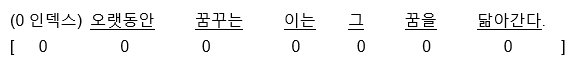
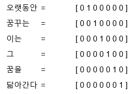
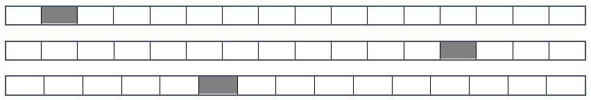
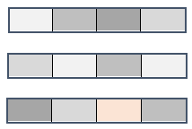
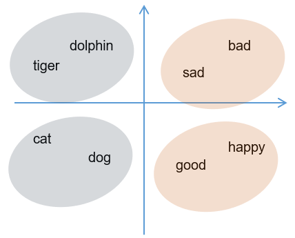
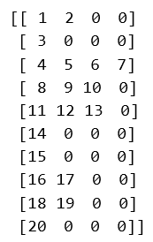

<div id="custom-blog-header">
  <div class="header-inner">
    <a href="/" class="site-name"><span class="blog-badge">blog</span></a>
    <nav>
      <a href="/about/">About Taeho Jo</a>
      <a href="https://www.jolab.ai" target="_blank">JoLab.ai</a>
    </nav>
  </div>
</div>

# 쉽게 이해하는 자연어 처리 

[](https://bit.ly/taehojo)

<br/> ‘**자연어**’란 우리가 평소에 말하는 음성이나 텍스트를 말합니다. ‘**자연어 처리**(NLP, Natural Language Processing)’는 이러한 음성이나 텍스트를 컴퓨터가 인식하고 처리하는 것을 의미합니다. 

컴퓨터를 이용해 인간의 말을 알아듣는 연구는 딥러닝이 나오기 이전부터 계속되어 왔습니다. 하지만 언어의 규칙은 컴퓨터의 규칙과 달라 해결되지 않는 여러 문제들을 안고 있었습니다. 딥러닝이 등장하고 나서야 많은 문제들이 해결되었지요. 이는 대용량 데이터를 학습할 수 있는 딥러닝의 속성 때문입니다. 비교적 쉽게 얻을 수 있는 자연어 데이터를 지속적으로 입력해 끊임없이 학습하는 것이 가능해지면서 딥러닝은 자연어 처리에 있어서 필수적인 요소가 되었습니다. 

수치로 된 데이터만 이해하는 컴퓨터 알고리즘이 언어를 이해하려면 주어진 텍스트를 정제하는 전처리 과정이 만드시 필요합니다. 그럼 자연어 처리를 위해 텍스트를 전처리 하는 과정부터 시작해 보겠습니다.

<br/>

## 1. 텍스트의 토큰화

 먼저 해야 할 일은 텍스트를 잘게 나누는 것입니다. 입력할 텍스트가 준비되면 이를 단어별, 문장별, 형태소별로 나뉠 수 있는데, 이렇게 작게 나누어진 하나의 단위를 **토큰**(token)이라 부릅니다. 그래서 입력된 텍스트를 잘게 나누는 과정을 **토큰화**(tokenization)라고 합니다. <br/>

예를 들어 다음 문장이 주어졌다고 가정해 봅시다.  <br/>

- **'해보지 않으면 해낼 수 없다'**<br/><br/>

케라스가 제공하는 text모듈의 text_to_word_sequence 함수를 사용하면 단어 단위로 문장을 쉽게 나눌 수 있습니다.  해당 함수를 불러, 전처리할 텍스트를 지정한 후, 다음과 같이 토큰화합니다.<br/>

```{.python}

from keras.preprocessing.text import text_to_word_sequence

 text = '해보지 않으면 해낼 수 없다'
 result = text_to_word_sequence(text)
 print(result)

```

<br/>

결과가 다음과 같이 출력됩니다. 

> ['해보지', '않으면', '해낼', '수', '없다']

<br/>

이렇게 주어진 텍스트를 단어 단위로 쪼개고 나면 이를 이용해 여러 가지를 할 수 있습니다. 예를 들어 각 단어가 몇 번이나 중복해서 쓰였는지를 알아보는 것이 가능합니다. 단어의 빈도 수를 알면 이를 통해 텍스트에서 중요한 역할을 하는 단어를 파악할 수 있기 때문에 가장 많이 쓰이는 전처리 과정입니다. 

<br/>**Bag-of-Words**라는 방법이 이러한 전처리를 일컫는 말인데, '**단어의 가방**(bag of words)'이라는 말 뜻 그대로, 같은 단어끼리 따로따로 가방에 담은 뒤 각 가방에 몇 개의 단어가 들어있는지를 세는 기법입니다. <br/><br/>

예를 들어 다음과 같은 세 개의 문장이 있다고 합시다. <br/><br/>

- **'먼저 텍스트의 각 단어를 나누어 토큰화 합니다.'**
- **'텍스트의 단어를 토큰화해야 딥러닝에서 인식됩니다.'**

- **'토큰화 한 결과는 딥러닝에서 사용 할 수 있습니다.'**

<br/>

이 세 문장에 등장하는 단어를 모두 세어 보고 출현 빈도가 가장 높은 것 부터 나열해 보면, '토큰화'가 3회, '딥러닝에서'가 2회, '텍스트의'가 2회, 그리고 나머지 단어들이 1회씩입니다. 세 문장에서 가장 많이 사용된 단어인 ‘토큰화, 딥러닝, 텍스트’가 위 세 문장에서 중요한 역할을 하는 단어임을 짐작할 수 있습니다. <br/>

케라스의 **Tokenizer** 함수를 사용하면 이러한 빈도수의 계산을 쉽게 계산할 수 있습니다. 다음 예제는 위에 제시된 세 문장의 단어를 빈도 수로 다시 정리해 보는 코드입니다. 먼저 케라스에서 제공하는 텍스트 전처리 함수 중 Tokenizer 함수를 불러 옵니다.

```{.python}

from keras.preprocessing.text import Tokenizer

```

<br/>전처리하려는 세 개의 문장을 docs라는 배열에 지정합니다.

```{.python}

docs = ['먼저 텍스트의 각 단어를 나누어 토큰화합니다.',
 '텍스트의 단어로 토큰화해야 딥러닝에서 인식됩니다.',
 '토큰화한 결과는 딥러닝에서 사용할 수 있습니다.',
 ]

```

<br/>토큰화 함수인 Tokenizer()를 이용해 전처리하는 과정은 다음과 같습니다.

```{.python}

token = Tokenizer()     	#토큰화 함수 지정
token.fit_on_texts(docs) 	#토큰화 함수에 문장 적용
print(token.word_counts) 	#단어의 빈도 수를 계산한 결과를 출력합니다.

```

<br/>마지막 줄에 있는 word_counts는 단어의 빈도 수를 계산해주는 함수입니다. 이를 출력한 결과는 다음과 같습니다.

> OrderedDict([('먼저', 1), ('텍스트의', 2), ('각', 1), ('단어를', 1), ('나누어', 1), ('토큰화', 3), ('합니다', 1), ('단어로', 1), ('해야', 1), ('딥러닝에서', 2), ('인식됩니다', 1), ('한', 1), ('결과는', 1), ('사용', 1), ('할', 1), ('수', 1), ('있습니다', 1)])

 <br/>

 ‘토큰화’가 3번, ‘텍스트의’와 ‘딥러닝에서’가 2번, 나머지가 1번씩 나오고 있음을 보여 줍니다. 순서를 기억하는 OrderedDict클래스에 담겨 있는 형태로 출력되는 것을 볼 수 있습니다. document_count함수를 이용하면 총 몇개의 문장이 들어있는지를 셀 수도 있습니다.  

```{.python}

print(token.document_count)

```

<br/>


> 3

<br/>

또한, word_docs함수를 통해 각 단어들이 몇 개의 문장에서 출현하는가를 세어서 출력할 수도 있습니다. 출력되는 순서는 랜덤입니다.

```{.python}

print(token.word_docs)

```

<br/>

>{'한': 1, '먼저': 1, '나누어': 1, '해야': 1, '토큰화': 3, '결과는': 1, '각': 1, '단어를': 1, '인식됩니다': 1, '있습니다': 1, '할': 1, '단어로': 1, '수': 1, '합니다': 1, '딥러닝에서': 2, '사용': 1, '텍스트의': 2}

<br/>

각 단어에 매겨진 인덱스 값을 출력하려면word_index함수를 사용하면 됩니다. 이 값은 다음 절에서 배울 ‘단어 임베딩’편에서 다시 나옵니다.

```{.python}

print(token.word_index)

```

<br/>


> {'딥러닝에서': 3, '단어를': 6, '결과는': 13, '수': 16, '한': 12, '인식됩니다': 11, '합니다': 8, '텍스트의': 2, '토큰화': 1, '할': 15, '각': 5, '있습니다': 17, '먼저': 4, '나누어': 7, '해야': 10, '사용': 14, '단어로': 9}

<br/>

지금까지 배운 내용을 정리해 보면 다음과 같습니다. 

<br/>

**주어진 문장을 ‘단어’로 토큰화 하기**

```{.python}
#케라스의 텍스트 전처리와 관련한 함수중 text_to_word_sequence 함수를 불러 옵니다.
from tensorflow.keras.preprocessing.text import text_to_word_sequence

# 전처리할 텍스트를 정합니다.
text = '해보지 않으면 해낼 수 없다'

# 해당 텍스트를 토큰화 합니다.
result = text_to_word_sequence(text)
print("\n원문:\n",text)
print("\n토큰화:\n",result)

#단어 빈도수 세기

#케라스의 텍스트 전처리와 관련한 함수중 Tokenizer 함수를 불러 옵니다.
from keras.preprocessing.text import Tokenizer

#전처리 하려는 세개의 문장을 정합니다.
docs = ['먼저 텍스트의 각 단어를 나누어 토큰화 합니다.',
		'텍스트의 단어로 토큰화 해야 딥러닝에서 인식됩니다.',
		'토큰화 한 결과는 딥러닝에서 사용 할 수 있습니다.',
		]

#토큰화 함수를 이용해 전처리 하는 과정입니다.
token = Tokenizer()       # 토큰화 함수 지정
token.fit_on_texts(docs)    # 토큰화 함수에 문장 적용

#단어의 빈도수를 계산한 결과를 각 옵션에 맞추어 출력합니다. 

print("\n단어 카운트:\n"'token.word_counts) 

#Tokenizer()의 word_counts 함수는 순서를 기억하는 OrderedDict클래스를 사용합니다.

#출력되는 순서는 랜덤입니다.
print("\n문장 카운트: "'token.document_count)
print("\n각 단어가 몇개의 문장에 포함되어 있는가:\n"'token.word_docs)
print("\n각 단어에 매겨진 인덱스 값:\n"'token.word_index)
```

<br/>


> 원문:
> 해보지 않으면 해낼 수 없다
>
> 토큰화:
> ['해보지', '않으면', '해낼', '수', '없다']
>
> 단어 카운트:
> OrderedDict([('먼저', 1), ('텍스트의', 2), ('각', 1), ('단어를', 1), ('나누어', 1), ('토큰화', 3), ('합니다', 1), ('단어로', 1), ('해야', 1), ('딥러닝에서', 2), ('인식됩니다', 1), ('한', 1), ('결과는', 1), ('사용', 1), ('할', 1), ('수', 1), ('있습니다', 1)])
>
> 문장 카운트: 3
>
> 각 단어가 몇개의 문장에 포함되어 있는가:
> {'한': 1, '먼저': 1, '나누어': 1, '해야': 1, '토큰화': 3, '결과는': 1, '각': 1, '단어를': 1, '인식됩니다': 1, '있습니다': 1, '할': 1, '단어로': 1, '수': 1, '합니다': 1, '딥러닝에서': 2, '사용': 1, '텍스트의': 2 }
>
> 각 단어에 매겨진 인덱스 값:
> {'딥러닝에서': 3, '단어를': 6, '결과는': 13, '수': 16, '한': 12, '인식됩니다': 11, '합니다': 8, '텍스트의': 2, '토큰화': 1, '할': 15, '각': 5, '있습니다': 17, '먼저': 4, '나누어': 7, '해야': 10, '사용': 14, '단어로': 9}

## <br/><br/>2. 단어의 원-핫 인코딩 

<br/>앞서 우리는 문장을 기계가 알아들을 수 있도록 토큰화하고 단어의 빈도 수를 확인해 보았습니다. 하지만 단순히 단어의 출현 빈도만 가지고는 해당 단어가 문장의 어디서부터 왔는지, 각 단어의 순서는 어떠했는지 등에 관한 정보를 얻을 수가 없습니다. <br/>

이에 단어가 문장의 다른 요소와 어떤 관계를 가지고 있는지를 알아보는 방법이 필요합니다. 이러한 기법 중에서 가장 기본적인 방법인 원-핫 인코딩에 대해서 알아보겠습니다. 예를 들어 다음과 같은 문장이 있습니다. <br/><br/>

- **'오랫동안 꿈꾸는 이는 그 꿈을 닮아간다'** <br/><br/>

각 단어를 모두 0으로 바꾸어 주고 원하는 단어만 1로 바꾸어 주는 것이 원-핫 인코딩이었습니다. 이를 수행하기 위해 먼저 단어 수만큼 0으로 채워진 벡터 공간으로 바꾸면 다음과 같습니다. <br/><br/>

<br/>

이제 각 단어가 배열 내에서 해당하는 위치를 1로 바꿔서 벡터화할 수 있습니다. <br/><br/>



 <br/>

이러한 과정을 케라스로 실습해 보겠습니다. 

 <br/>

먼저 토큰화 함수를 불러와 단어 단위로 토큰화하고 그리고 각 단어의 인덱스 값을 출력해 봅니다.

```{.python}

from keras_preprocessing.text import Tokenizer
 
 text="오랫동안 꿈꾸는 이는 그 꿈을 닮아간다"
 
 token = Tokenizer()
 token.fit_on_texts([text]) 
 print(token.word_index)

```

<br/>결과는 다음과 같습니다. 

>{'꿈을': 5, '꿈꾸는': 2, '그': 4, '닮아간다': 6, '이는': 3, '오랫동안': 1}

<br/>

이제 각 단어를 원-핫 인코딩 방식으로 표현해 보겠습니다. 케라스에서 제공하는 Tokenizer의 texts_to_sequences함수를 사용해서 앞서 만들어진 토큰의 인덱스로만 채워진 새로운 배열을 만들어 줍니다. 

```{.python}

 x=token.texts_to_sequences([text]) 
 print(x)

```

<br/>


> [[1,2,3,4,5,6]]

<br/>

이제 1~6까지의 정수로 인덱스 되어 있는 것을 0 과 1로만 이루어진 배열로 바꾸어 주는 함수 to_categorical()을 사용해 원-핫 인코딩 과정을 진행합니다. 배열 맨 앞에 0이 추가되므로 단어 수보다 1이 더 많게 인덱스 숫자를 잡아 주는 것에 유의합니다.

```{.python}

from keras.utils import to_categorical 
 word_size = len(t.word_index) +1  # 인덱스 수에 하나를 추가해서 원핫 인코딩 배열을 만듭니다.
 x = to_categorical(x, num_classes=word_size) 
 print(x)

```

<br/>결과는 다음과 같습니다. 예제 문장을 이루고 있는 단어들이 위에서부터 차례로 벡터화되었습니다..

>[[[0. 1. 0. 0. 0. 0. 0.] <br/>
>[0. 0. 1. 0. 0. 0. 0.] <br/>
>[0. 0. 0. 1. 0. 0. 0.] <br/>
>[0. 0. 0. 0. 1. 0. 0.] <br/>
>[0. 0. 0. 0. 0. 1. 0.] <br/>
>[0. 0. 0. 0. 0. 0. 1.]]] <br/>

<br/><br/>

## 3. 단어 임베딩

 <br/>

원-핫 인코딩에 더불어 한 가지 공부해야 할 것이 더 있습니다. 원-핫 인코딩을 그대로 사용하면 벡터의 길이가 너무 길어진다는 단점이 있습니다. 예를 들어 1만 개의 단어 토큰으로 이루어진 말뭉치를 다룬다고 할 때, 이 데이터를 원-핫 인코딩으로 벡터화한다면 9,999개의 0과 하나의 1로 이루어진 단어 벡터를 1만 개나 만들어야 합니다. 이러한 공간적 낭비를 해결하기 위해 등장한 것이 **단어 임베딩**(word embedding)이라는 방법입니다.  

 <br/>

단어 임베딩은 주어진 배열을 정해진 길이로 압축시킵니다. Figure 1과 Figure 2는 원-핫 인코딩을 사용해 만든 16차원의 벡터가 단어 임베딩을 통해 4차원 벡터로 바뀐 예를 보기 쉽게 비교한 것입니다.

 <br/>



**Figure 1**. 원-핫 인코딩과 단어 임베딩 <br/>



**Figure 2**. 단어 임베딩의 결과

 <br/>

단어 임베딩으로 얻은 결과가 밀집된 정보를 가지고 있고 공간의 낭비가 적다는 것을 알 수 있습니다. 이런 결과가 가능한 이유는 각 단어 간의 **유사도**를 계산했기 때문입니다. 예를 들어 happy라는 단어는 bad 보다 good에 더 가깝고, cat이라는 단어는 good보다는 dog에 가깝다는 것을 고려하여 각 배열을 새로운 수치로 바꾸어 주는 것입니다(Figure 3). <br/>




**Figure 3**. 단어 간의 유사도

 <br/>

<br/>그렇다면 이 단어 간 유사도는 어떻게 해서 계산하는 것일까요? 여기서 앞서 배운 오차 역전파가 또다시 등장합니다. 적절한 크기로 배열을 바꾸어 주기 위해 최적의 유사도를 계산하는 학습의 과정을 거치는 것이지요. 이 과정은 케라스에서 제공하는 Embedding함수를 사용하면 간단히 해낼 수 있습니다. 예를 들어 다음과 같이 임베딩 함수를 적용해 딥러닝 모델을 만들 수 있습니다.

```{.python}

from kreas.layers import Embedding
 
 model = Sequential()
 model.add(Embedding(16,4)

```

<br/>Embedding() 함수는 최소 2개의 매개변수를 필요로 하는데, 바로 ‘입력’과 ‘출력’의 크기입니다. 위 예제에서 ‘Embedding(16,4)’가 의미하는 바는 입력될 총 단어 수는 16, 임베딩 후 출력되는 벡터 크기는 4로 하겠다는 뜻입니다. 여기에 단어를 매번 얼마나 입력할지를 추가로 지정할 수 있습니다. ‘Embedding(16,4, input_length=2)’라고 하면 총 입력되는 단어 수는 16개이지만 매번 2개씩만 집어 넣겠다는 뜻입니다. 

 <br/>

단어 임베딩의 예는 직접 실습을 통해 확인해 보겠습니다. 다음 절에서 단어 임베딩을 포함, 지금까지 배운 내용들을 모두 적용해 텍스트 감정을 예측하는 딥러닝 모델을 만들어 보겠습니다.

 <br/><br/>

## 4. 텍스트를 읽고 긍정, 부정 예측하기 

 <br/>

실습해 볼 과제는 영화를 보고 남긴 리뷰를 딥러닝 모델로 학습해서, 각 리뷰가 긍정적인지 부정적인지를 예측하는 것입니다. <br/>

먼저 짧은 리뷰 10개를 불러와 각각 긍정이면 1이라는 클래스를, 부정적이면 0이라는 클래스로 지정합니다.

```{.python}

# 텍스트 리뷰 자료를 지정합니다.
docs = ['너무 재밌네요',’최고예요','참 잘 만든 영화예요','추천하고 싶은 영화입니다.','한 번 더 보고싶네요','글쎄요','별로예요','생각보다 지루하네요','연기가 어색해요','재미없어요']

#긍정 리뷰는 1, 부정 리뷰는 0으로 클래스를 지정합니다.
class = array([1,1,1,1,1,0,0,0,0,0])

```

<br/>그 다음 앞서 배운 토큰화 과정을 진행합니다. 케라스 Tokenizer함수의 fit_on_text를 이용해 각 단어를 하나의 토큰으로 변환합니다. 

```{.python}

# 토큰화 
token = Tokenizer()
token.fit_on_texts(docs)

print(token.word_index) #토큰화 된 결과를 출력해 확인합니다.

```

<br/>그럼 다음과 같이 출력됩니다.

>{'생각보다': 16, '만든': 6, '영화입니다': 10, '한 번': 11, '영화예요': 7, '싶은': 9, '보고싶네요': 13, '어색해요': 19, '재미없어요': 20, '더': 12, '추천하고': 8, '지루하네요': 17, '최고예요': 3, '잘': 5, '참': 4, '재밌네요': 2, '별로예요': 15, '글쎄요': 14, '연기가': 18, '너무': 1}.

<br/>

이제 토큰에 지정된 인덱스로 새로운 배열을 생성합니다.

```{.python}

x = token.texts_to_sequences(docs)
print(x)

```

<br/>그럼 주어진 텍스트는 숫자로 이루어진 다음과 같은 배열로 재편됩니다.

>[[1, 2], [3], [4, 5, 6, 7], [8, 9, 10], [11, 12, 13], [14], [15], [16, 17], [18, 19], [20]]

<br/>

각 단어가 1부터 20까지의 숫자로 토큰화되었다는 것을 알 수 있습니다. 그런데 입력된 리뷰 데이터의 토큰수가 각각 다르다는 것에 유의하시기 바랍니다. 예를 들어 ‘최고예요’는 하나의 토큰 ([3])이지만 ‘참 잘 만든 영화예요’는 4개의 토큰([4, 5, 6, 7])을 가지고 있지요. 딥러닝 모델에 입력하기 위해서는 학습 데이터의 길이가 동일하게 만들어 주어야 합니다. 

<br/> 길이를 똑같이 맞춰 주는 작업을 **패딩**(padding)과정이라고 합니다. 패딩은 자연어 처리 뿐 아니라 GAN에서도 중요한 역할을 하니 잘 기억해 두시기 바랍니다. 패딩 작업을 위해 케라스는 pad_sequence함수를 제공합니다. pad_sequnce를 사용하면 원하는 길이보다 짧은 부분은 숫자 0을 넣어서 채워주고, 긴 데이터는 잘라서 같은 길이로 맞춥니다. 위에 준비된 x배열을 4개의 길이로 맞추어 주려면 다음과 같이 실행합니다.

```{.python}

padded_x = pad_sequences(x, 4) #서로 다른 길이의 데이터를 4로 맞추어 줍니다.
print(padded_x)

```

<br/>그럼 다음과 같이 배열의 길이가 맞춰집니다.

>

<br/>

이제 단어 임베딩을 포함하여 딥러닝 모델을 만들고 결과를 출력해 보겠습니다. 임베딩 함수에 필요한 세 가지 파라미터는 *입력'출력'단어 수*입니다. 총 몇 개의 단어 집합에서(*입력*), 몇 개의 임베딩 결과를 사용할 것인지(*출력*), 그리고 매번 입력될 단어 수는 몇 개로 할지(*단어 수*)를 정해야 하는 것입니다. 

 <br/>

먼저 총 몇 개의 인덱스가 입력되어야 하는지를 정해 줍니다. word_size라는 변수를 만든 뒤, 길이를 세는 len() 함수를 이용해 word_index값을 여기 집어 넣습니다. 이때 전체 단어의 맨 앞에 0이 먼저 나와야 하므로 단어의 총 수에 1을 더다.

```{.python}

word_size = len(token.word_index) +1

```

<br/>이제 몇개의 임베딩 결과를 사용할 것인지(*출력*)를 정할 차례입니다. 이번 예제에서는 word_size만큼의 입력값을 이용해 8개의 임베딩 결과를 만들겠습니다. 8이라는 숫자는 임의로 정한 것입니다. 데이터에 따라 적절한 값으로 바꿀 수 있습니다. 이때 만들어 지는 8개의 임베딩 결과는 우리 눈에 보이지 않습니다. 내부적으로 계산하여 딥러닝의 레이어로 활용하게 됩니다. 끝으로 *단어수*를 정할 차례입니다. 패딩 과정을 거쳐 4개씩의 길이로 맞춰 주었으므로 4개의 단어가 들어가게 설정해 주면 임베딩 과정은 다음 한 줄로 표현됩니다.

```{.python}

Embedding(word_size, 8, input_length=4)

```

<br/>이를 이용해 모델을 만들면 다음과 같습니다.

```{.python}

#단어 임베딩을 포함하여 딥러닝 모델을 만들고 결과를 출력합니다.

model = Sequential()
model.add(Embedding(word_size, 8, input_length=4))
model.add(Flatten())
model.add(Dense(1, activation='sigmoid'))
model.compile(optimizer='adam', loss='binary_crossentropy', metrics=['accuracy'])
model.fit(padded_x, labels, epochs=30)
print("\n Accuracy: %.4f" % (model.evaluate(padded_x, labels)[1]))

```

<br/>옵티마이저로 adam을 사용하고 오차 함수로는 'binary_crossentropy'를 썼습니다. 30번 반복하고나서 정확도를 계산하여 출력하게 했습니다.

<br/>

지금까지의 모든 과정을 한눈에 보면 다음과 같습니다. 

<br/>**영화 리뷰가 긍정적인지 부정적인지예측하기**

```{.python}

import numpy
import tensorflow as tf
from numpy import array
from tensorflow.keras.preprocessing.text import Tokenizer
from tensorflow.keras.preprocessing.sequence import pad_sequences
from tensorflow.keras.models import Sequential
from tensorflow.keras.layers import Dense,Flatten,Embedding

#seed값 생성
seed = 0
numpy.random.seed(seed)
tf.compat.v1.set_random_seed(seed)

#텍스트 리뷰 자료를 지정합니다.
docs = ['너무 재밌네요',’최고예요','참 잘 만든 영화예요','추천하고 싶은 영화입니다.','한번 더 보고싶네요','글쎄요','별로예요','생각보다 지루하네요','연기가 어색해요','재미없어요']

#긍정 리뷰는 1, 부정 리뷰는 0**으로 클래스를 지정합니다*.
class = array([1,1,1,1,1,0,0,0,0,0])

#토큰화 
token = Tokenizer()
token.fit_on_texts(docs)

print(token.word_index)

# 서로 다른 길이의 데이터를 4로 맞추어 줍니다.
padded_x = pad_sequences(x, 4) print(padded_x)

#임베딩에 입력될 단어의 수를 지정합니다.
word_size = len(token.word_index) +1

#단어 임베딩을 포함하여 딥러닝 모델을 만들고 결과를 출력합니다.
model = Sequential()
model.add(Embedding(word_size, 8, input_length=4))
model.add(Flatten())
model.add(Dense(1, activation='sigmoid'))
model.compile(optimizer='adam', loss='binary_crossentropy', metrics=['accuracy'])
model.fit(padded_x, labels, epochs=30)
print("\n Accuracy: %.4f" % (model.evaluate(padded_x, labels)[1]))
 
```

<br/>


> Train on 10 samples<br/>
> Epoch 1/30<br/>
> 10/10 [==============================] - 4s 448ms/sample - loss: 0.6973 - acc: 0.4000<br/>
> Epoch 2/30<br/>
> 10/10 [==============================] - 0s 799us/sample - loss: 0.6950 - acc: 0.4000<br/>
>
> (중략)<br/>
>
> Epoch 29/30<br/>
> 10/10 [==============================] - 0s 100us/sample - loss: 0.6314 - acc: 1.0000<br/>
> Epoch 30/30<br/>
> 10/10 [==============================] - 0s 198us/sample - loss: 0.6290 - acc: 1.0000<br/>
> 10/1 [============================] - 0s 11ms/sample - loss: 0.6266 - acc: 1.0000<br/>
> Accuracy: 1.0000<br/>

<br/>

학습 후 10개의 샘플을 각각 테스트해 보았을 때 긍정과 부정을 모두 맞추었음을 알 수 있습니다.

<br/>

 

