# 딥러닝 + 유전변이 예측

 

> **질문**: 딥러닝으로 데이터 전처리 없이 whole genome 데이터를 사용해 질병을 유발하는 유전변이를 찾아 낼 수 있을까?  
>
> **논문의 결론**:  3단계로 나뉘어진 딥러닝 프레임워크로 유전변이를 찾을 수 있었고, 이를 알츠하이머 병의 진단에 적용해서 유용성을 확인 하였습니다.  

 

## **딥러닝을 이용한 유전자 변이 예측 : 알츠하이머병 예측에 적용**

딥러닝은 많은 과학 분야에 성공적으로 적용되었지만 유전체 데이터의 high-dimensionality 으로 인해 GWAS(Genome-wide Association Studies)에서는 사용되기가 어려웠습니다. 이 포스트는 이러한 문제를 극복하기 위하여 새로운 딥러닝 프레임워크를 제안한 "Deep learning-based identification of genetic variants: Application to Alzheimer’s disease classification"(2021) 논문을 옮긴 것입니다.   

[논문 바로가기](https://www.medrxiv.org/content/10.1101/2021.07.19.21260789v1)

이 방법은 질병 관련 단일 염기 다형성(Single nucleotide polymorphisms,SNP)을 식별하고 딥러닝을 사용해 유전 변이를 찾기 위한 3단계 접근을 제안합니다. 

첫째, 전체 게놈을 겹치지 않는 최적 크기의 조각으로 나누는 것입니다. 그리고 각 조각에 대해 1D CNN(Convolutional Neural Network) 알고리즘을 실행하여 질병과 관련된 조각을 선택합니다. 

둘째, 딥러닝과 overlapping 윈도우를 사용해 각 SNP별 표현형 영향 점수(Phenotype influence score, PIS)를 계산했습니다. 이를 통해 질병과 관련된 SNP를 식별합니다. 

셋째, 이 정보를 실제 질병을 분류하는데 적용합니다. 우리의 방법을 인지적 정상(CN) 참가자와 알츠하이머병(AD) 진단을 받은 참가자의 whole genome 데이터(N=981, CN = 650, AD=331)에 적용했을때, 0.82의 AUC를 달성했습니다. 

이 방법의 결과는 human intervention이 거의 없었음에도, 데이터 전처리를 동반한 기존의 기계 학습 접근 방식을 능가한 결과를 보였습니다. 이 방법은 알츠하이머 병의 유발에 관련된 것으로 잘 알려져 있는 *APOE* 영역을 최중요 유전자좌로 식별했으며,  *APOE*영역 이외에도 몇몇 새로운 후보 유전자를 알츠하이머 관련 유전자로 제안 했습니다. 

이 논문에서 설명하는 딥러닝 기반 GWAS 접근 방식은 질병 관련 SNP를 식별하고 유전 변이를 찾으며, whole genome 데이터만으로 특정 질병의 여부를 판단하는 모델의 예를 보여주고 있습니다. 

  

**Deep learning-based identification of genetic variants: Application to Alzheimer’s disease classification**   

Taeho Jo, Kwangsik Nho, Paula Bice, and Andrew J. Saykin

  

## Abstract

Deep learning is a promising tool that uses nonlinear transformations to extract features from high-dimensional data. Although deep learning has been used in several genetic studies, it is challenging in genome–wide association studies (GWAS) with high-dimensional genomic data. Here we propose a novel three-step approach for identification of genetic variants using deep learning to identify phenotype-related single nucleotide polymorphisms (SNPs) and develop accurate classification models. In the first step, we divided the whole genome into non-overlapping fragments of an optimal size and then ran Convolutional Neural Network (CNN) on each fragment to select phenotype-associated fragments. In the second step, using an overlapping window approach, we ran CNN on the selected fragments to calculate phenotype influence scores (PIS) and identify phenotype-associated SNPs based on PIS. In the third step, we ran CNN on all identified SNPs to develop a classification model. We tested our approach using genome-wide genotyping data for Alzheimer’s disease (AD) (N=981; cognitively normal older adults (CN) =650 and AD=331). Our approach identified the well-known *APOE* region as the most significant genetic locus for AD. Our classification model achieved an area under the curve (AUC) of 0.82, which outperformed traditional machine learning approaches, Random Forest and XGBoost. By using a novel deep learning-based GWAS approach, we were able to identify AD-associated SNPs and develop a better classification model for AD.

 

 **Author summary**

Although deep learning has been successfully applied to many scientific fields, deep learning has not been used in genome–wide association studies (GWAS) in practice due to the high dimensionality of genomic data. To overcome this challenge, we propose a novel three-step approach for identification of genetic variants using deep learning to identify disease-associated single nucleotide polymorphisms (SNPs) and develop accurate classification models. To accomplish this, we divided the whole genome into non-overlapping fragments of an optimal size and ran a deep learning algorithm on each fragment to select disease-associated fragments. We calculated phenotype influence scores (PIS) of each SNP within selected fragments to identify disease-associated significant SNPs and developed a disease classification model by using overlapping window and deep learning algorithms. In the application of our method to Alzheimer’s disease (AD), we identified well-known significant genetic loci for AD and achieved higher classification accuracies than traditional machine learning methods. This study is the first study to our knowledge to develop a deep learning-based identification of genetic variants using fragmentation and window approaches as well as deep learning algorithms to identify disease-related SNPs and develop accurate classification models.

## Introduction

Deep learning is a representative machine learning algorithm that enables nonlinear transformations to extract features of high-dimensional data 1, unlike traditional machine learning models that predict a linear combination of weights by assuming a linear relationship between input features and a phenotype of interest. Deep learning has been used to predict disease outputs by handling original high-dimensional medical imaging data without feature selection procedures 2, 3. In genetic research, deep learning frameworks have been used to investigate molecular phenotypes that predict the effects of non-coding variants4-10, differential gene expression 11, and potential transcription factor binding sites 12. These tools use CHIP-Seq or DNase-Seq data as training data to predict chromatin features such as transcription factor binding or DNase hypersensitivity from DNA sequences. More recently, deep learning has been employed in the capture of mutations and the analysis of gene regulations, demonstrating its potential for furthering our understanding of epigenetic regulation 13. Furthermore, deep learning is being used in gene therapy to design CRISPR guide RNAs using deep learning-based gene features 14-19.

Genome-wide association studies (GWAS) use a statistical approach by considering one single nucleotide polymorphism (SNP) at a time across the whole genome to identify population-based genetic risk variation for human diseases and traits 20, 21. However, deep learning has not yet been used to perform GWAS, as it is challenging due to the so-called high-dimension low-sample-size (HDLSS) problem 22, which is known to impact phenotype prediction using genetic variation. Feature reduction approaches have been commonly used 23-25 to resolve this problem, but feature reduction using high-dimensional genomic data is also challenging due to a NP-hard problem26, 27. Therefore, it is necessary to develop a deep learning framework to identify genetic variants using whole genome data.

Here we proposed a novel three-step deep learning-based approach to select informative SNPs and develop classification models for a phenotype of interest. In the first step, we divided the whole genome into non-overlapping fragments of an optimal size and then used deep learning algorithms to select phenotype-associated fragments containing phenotype-related SNPs. Different sized fragments and several deep learning algorithms were tested to select the optimal size for fragments and the optimal algorithm. In the second step, we ran the optimal deep learning algorithm using an overlapping sliding window approach within selected fragments to calculate phenotype influence scores (PIS) using SNPs and the phenotype of interest to identify informative SNPs. In the third step, we ran the optimal algorithm again on all identified informative SNPs to develop a classification model.

We tested our approach using only whole genome data for Alzheimer’s disease (AD) (N=981; cognitively normal older adults (CN) =650 and AD=331). Our approach identified the known *APOE* region as the most significant genetic locus for AD. Our classification model yielded 75.2% accuracy over traditional machine learning methods, being 3.8% and 9.6% higher than XG Boost and Random Forest, respectively. Our novel deep learning-based approach can identify informative SNPs and develop a classification model for AD by combining nearby SNPs and testing their aggregation. 

 

## Materials and Methods

**Study participants**

All individuals used in the analysis were participants of the Alzheimer’s Disease Neuroimaging Initiative (ADNI) cohort 28, 29. The ADNI initial phase (ADNI-1) was launched in 2003 to test whether serial magnetic resonance imaging (MRI), position emission tomography (PET), other biological markers, and clinical and neuropsychological assessment could be combined to measure the progression of Mild Cognitive Impairment (MCI) and early AD. ADNI-1 has been extended in subsequent phases (ADNI-GO, ADNI-2, and ADNI-3) for follow-up of existing participants and additional new enrollments. Demographic information, *APOE* and whole-genome genotyping data, and clinical information are publicly available from the ADNI data repository (www.loni.usc.edu/ADNI/). Informed consent was obtained for all subjects, and the study was approved by the relevant institutional review board at each data acquisition site.

**Genotyping and imputation**

ADNI participants were genotyped using several Illumina genotyping platforms including Illumina Human610-Quad BeadChip, Illumina HumanOmni Express BeadChip, and Illumina HumanOmni 2.5M BeadChip 30. As ADNI used different genotyping platforms, we performed quality control procedures (QC) on each genotyping platform data separately and then imputed un-genotyped single nucleotide polymorphisms (SNPs) separately using MACH and the Haplotype Reference Consortium (HRC) data as a reference panel 31. Before imputation, we performed QC for samples and SNPs as described previously: (1) for SNP, SNP call rate < 95%, Hardy-Weinberg *P* value < 1´10-6, and minor allele frequency (MAF) < 1%; (2) for sample, sex inconsistencies, and sample call rate < 95% 32. Furthermore, in order to prevent spurious association due to population stratification, we selected only non-Hispanic participants of European ancestry that clustered with HapMap CEU (Utah residents with Northern and Western European ancestry from the CEPH collection) or TSI (Toscani in Italia) populations using multidimensional scaling (MDS) analysis and the HapMap genotype data 32, 33. After imputation, we performed standard QC on imputed genotype data as described previously 34. Specifically, we imposed an r2 value equal to 0.30 as the threshold to accept the imputed genotypes. In the study, imputed genome-wide genotyping data from 981 ADNI non-Hispanic participants (650 cognitive normal older adults (CN) and 331 AD patients) were used with a total of 5,398,183 SNPs (minor allele frequency (MAF) > 5%).

**Genome-wide association study (GWAS)**

Using imputed genotypes, a GWAS for AD was conducted. For the GWAS, logistic regression with age and sex as covariates was performed using PLINK35 to determine the association of each SNP with AD. To adjust for multiple testing, a conservative threshold for genome-wide significant association (*p* < 5 × 10−8) was employed based on a Bonferroni correction.

**Fragmentation of whole genome data**

Whole genome data for 981 participants were divided into non-overlapping fragments of varying sizes from 10 SNPs to 200 SNPs to determine the optimal fragmentation size. The sub-data sets consisting of fragments of the same size were divided into train-test-validation sets (60:20:20), and Convolutional Neural Network (CNN)36, Long short-term memory (LSTM)37, LSTM-CNN38, and Attention39 algorithms were applied to each. Early stopping using a validation set was applied to prevent over-fitting, followed by the measurement of training time and accuracy (ACC).

**Deep learning on fragments**

Deep learning is the result of continuous development such as perceptron40, 41, which adds the concept of weight adjustment to the theory that it can behave like a human brain when neurons with on-off functions are connected in a network form42, and Adaline43, which uses gradient descent to update weights. These early neural nets were advanced to a multilayer perceptron, which includes hidden layers to solve the famous XOR problem44, marking a theoretical turning point with the concept of backpropagation to update the weight of the hidden layer45-48. The inherent problem of backpropagation, in which vanishing gradients occur when there are many layers49, has been alleviated through activation functions, such as sigmoid function and ReLU50, 51, and optimization methods for better gradient descent methods, such as Ada-Grad52, RMSprop53, and Adam54. These developments, along with the advancement of GPU hardware, have created an era of deep learning as it is now.

Deep learning has laid the theoretical foundation for backpropagation, the application of activation functions, and the development of optimizers for better gradient descent. Common deep learning algorithms, such as CNN, LSTM, and Attention, have a hierarchical structure that implements an enhanced version of the basic principles of deep learning. The detailed technical description of each algorithm is described extensively in the relevant paper, so here we focus on the core of the deep learning technology commonly applied to the algorithm used in the experiment.

We used ReLU as an activation function that underlies the deep learning algorithms used in our experiments.

 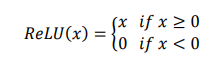

ReLU, the most used activation function in the deep learning community, replaces the given value with zero if the value is < 0 and uses the given value if it is > 0. Thus, if the given value is greater than zero, the derivative becomes one, and the weight can be adjusted without vanishing the gradient to the first layer through the hidden layer. We used Adam as the optimization method. Adam, is currently the most popular optimization method for deep learning, as it takes advantage of momentum SGD55 and RMSprop, which are expressed as follows: Gt is the sum of the square of the modified gradient, and ε is a very small constant that prevents the equation from being divided by zero.

  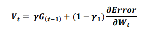

 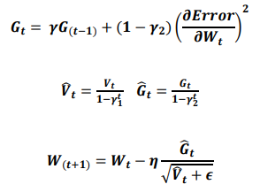

Backpropagation is used to calculate the initial error value from a given random weight using the least squares method and then to update the weight using a chain rule until the differential value becomes zero. Here, the differential value of zero means that the weight does not change when the gradient is subtracted from the previous weight.

 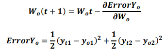

If yo1 and yo2 are the output values of the output layer coming through the hidden layer, and the actual values of the given data are yt1 and yt2, the partial derivative of the error ErrorYo to the weight of the output layer can be calculated using the chain rule as follows: 

 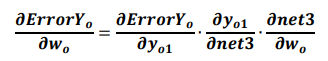

​    The partial derivative of the error ErrorYo to the weight of the hidden layer can be calculated as follows:

 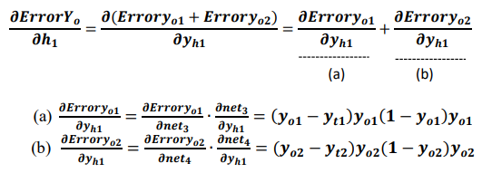

Accordingly, the weight wh of the hidden layer is updated as follows:

 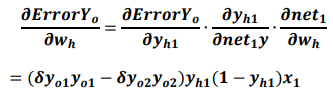

**Calculation of phenotype influence score using deep learning**

Prediction accuracy was calculated from deep learning applied to each fragment and converted to a z-score. The z-score follows a normal distribution with µ = 1 and σ = 0, under the hypothesis that there is no relationship between the variables in the population. Fragments with a z-score higher than the median were selected. An overlapping sliding window for the calculation of PIS is applied to these fragments (Figure 1). When the length of the fragment is w, the window is positioned w-1 from the first SNP of the fragment and moves by one SNP and stops at the last SNP of the fragment. Each region within the sliding window is divided into a train-test-validation set (60:20:20), and early stopping using a validation set is applied to prevent over-fitting. When the kth SNP is Sk, PIS is calculated as follows.

 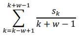

This sliding window is applied to all selected fragments, resulting in a PIS score for all SNPs.

 

**Phenotype classification using deep learning**

We selected the top 100 to 10,000 SNPs based on the PIS. We used CNN, XG boost and Random Forest for the AD-CN classification with 10-fold cross validation. The CNN that we used consisted of convolution layer with a kernel size of 5, pooling lay with max-pool size of 2, fully connected layer of 64 nodes, and output layer with softmax activation function. XG Boost is a tree-based ensemble algorithm, one of popular implementations of gradient boosting. We trained XGboost using a “xgboost” package for python (https: //xgboost.readthedocs.io/). Random Forest is another ensemble learning method which uses many decision trees as its classifiers56, 57. We trained Random Forest using the scikit-learn package for python by setting the number of trees as 10 and the maximum depth of each tree as 3. 

 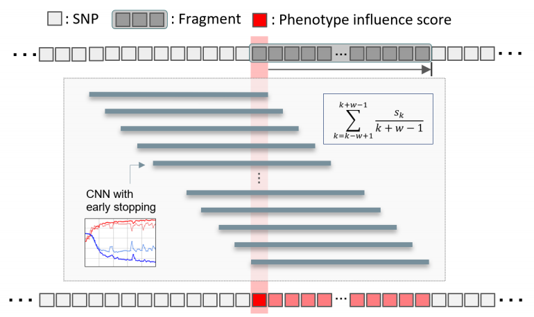

  **[Figure1] Framework to calculate phenotype influence scores of SNPs.** We divided the whole genome into 134,955 fragments, each with 40 SNPs. To calculate a phenotype influence score for each of the 40 SNPs included in one fragment, we used an overlapping window approach and CNN. w is the number of SNPs in the fragment and Sk is the kth SNP in the fragment.

 

## Results

Our deep learning-based approach consists of three steps to select informative SNPs and develop an accurate classification model. In the first step, we divided the whole genome into non-overlapping fragments of an optimal size. To choose an optimal fragment size and an optimal deep learning algorithm, we calculated the mean accuracy and computation time for classification of AD using various fragment sizes containing 10 to 200 SNPs and several deep learning algorithms (CNN, LSTM, LSTM-CNN, Attention). In this analysis, we used 10-200 SNPs located within a region surrounding the *APOE* gene, the strongest and most robust AD genetic risk locus. Figure 2 showed the mean accuracy and computation time for CNN, LSTM, LSTM-CNN, and Attention as a function of the fragment size. As shown in Fig. 2A, the analysis yielded the highest accuracy for classification of AD for a fragment size with 40 SNPs (Fig. 2A). For the fragment with 40 SNPs within a region surrounding the *APOE* gene, both CNN and LSTM-CNN models had the highest accuracy for classification of AD, followed by LSTM. However, the computation time of CNN and LSTM models were 5.9 seconds and 40.4 seconds, respectively. The computation time of LSTM, LSTM-CNN, and Attention models sharply increased compared to CNN as the fragment contains more SNPs (Fig 2B). Thus, we chose the fragment of 40 SNPs and CNN as an optimal fragment size and an optimal deep learning algorithm, respectively. The whole genome was divided into 134,955 fragments, each with 40 SNPs. We ran CNN on each fragment to calculate z-scores based on classification accuracy and selected phenotype-associated fragments. We selected 1,802 fragments with z-scores higher than a median z-score.

In the second step, using an overlapping window approach, we ran CNN on the selected fragments to calculate the PIS of each SNP in the selected fragments and identify phenotype-associated SNPs based on the PIS, as shown in Fig. 1. For each SNP, we calculated a mean accuracy of 40 windows, which is the PIS of the SNP. Using PIS values, we calculated the z-scores and one-tailed p-values. Figure 3 showed a Manhattan plot that plotted the -log10 p-values on the y-axis against the SNP position in the genome on the x-axis. The SNP with the smallest p-value was rs5117 in the *APOC1* gene (p-value=1.04E-22) and rs429358 in the *APOE* gene (p-value of 1.41E-16). The genetic region including *APOE*/*APOC1*/*TOMM40* genes is known as the strongest genetic risk locus for AD58-61. Next highest genetic loci were located at *SNX14*, *SNX16*, *BICD1*, *WDR72*, and *GLT1D1* genes.  

In the third step, we ran CNN on the identified SNPs to develop an AD classification model. Table 1 shows the classification results of AD vs. CN using subsets containing the top 100 to 10,000 SNPs based on PIS. For comparison with traditional machine learning methods, we used two popular algorithms, XG Boost and Random Forest, as classifiers. The highest mean accuracy of 10-cross validation in classifying AD from CN by CNN was 75.02% (area under the curve (AUC) of 0.8157) for a subset containing 4,000 SNPs, which had 6.3% higher accuracy than Random Forest for a subset containing 2,000 SNPs and 1.94% higher accuracy than XG Boost for a subset containing 1,000 SNPs. When we calculated the classification accuracy of AD using only the number of *APOE* ε4 alleles, the classification accuracy was 66.7%, which was 8.3% lower than our method. Our CNN models outperformed two traditional machine learning models, Random Forest and XGBoost, in all cases as shown in Fig. 4.

Figure 5 showed LocusZoom plots62 for SNPs located at 300 kb upstream and downstream regions from the boundary of the *APOE* gene. The horizontal axis is the location of SNPs, and the vertical axis is -log10 of the p-values. Each dot represents a SNP and the color represents the squared correlation coefficient (r2) with the most significant SNP. Figure 5A shows p-values calculated using PLINK and the most significant SNP was rs429358 in *APOE*. Figure 5B showed p-values calculated using our deep learning approach, and the most significant SNP was rs5117 in *APOC1*. In Fig. 5B, we can see a linear increase on the left side of rs5117 and a linear decrease on the right side of rs5117, which was different from PLINK results (Fig. 5A), which has no linear patterns. In addition, in Fig. 5B, we can see three strongly correlated SNPs (r2>0.8) with rs5117 on the left side of rs5117 but no SNPs on the right side of rs5117.

 

 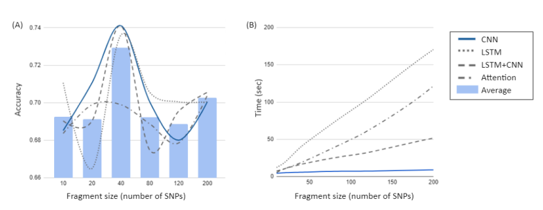

**[Figure2] Selection of an optimal fragment size and an optimal deep learning algorithm.** In order to choose an optimal fragment size and an optimal deep learning algorithm, we calculated the mean accuracy and computation time for classification of AD using various fragment sizes containing 10 to 200 SNPs in the *APOE* region and several deep learning algorithms (CNN, LSTM, LSTM-CNN, and Attention). (A) Mean accuracy as a function of the fragment size. The highest accuracy for classification of AD was obtained with a fragment having 40 SNPs in CNN, LSTM-CNN and LSTM models. (B) Computation time as a function of the fragment size. The computation time of CNN and LSTM models are 5.9 seconds and 40.4 seconds, respectively. Especially the computation time of LSTM, LSTM-CNN, and Attention models sharply increases compared to CNN as the fragment contains more SNPs. 

 

 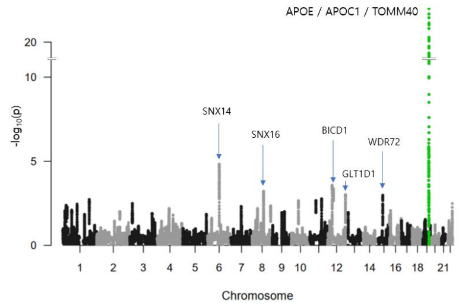

**[Figure 3] Manhattan plot of p-values of SNPs by our deep learning based approach in AD.** The X-axis shows SNP positions in the genome. The Y-axis shows -log10 of p-values. The genetic region including *APOE*, *APOC1*, and *TOMM40* genes is known as the strongest genetic risk locus for Alzheimer’s disease. The SNP with the smallest p-value was rs5117 in *APOC1* gene (P=1.04E-22). rs429358 in *APOE* has a p-value of 1.41E-16. Next identified genetic loci were located at *SNX14*, *SNX16*, *BICD1*, *WDR72*, and *GLT1D1* genes. 

 

 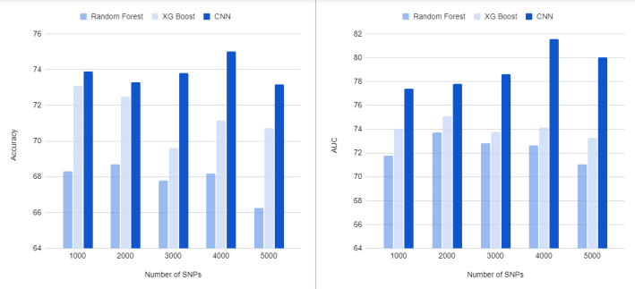

**[Figure 4] Results of classification of AD from CN.** The X-axis shows the number of top SNPs selected based on phenotype influence score for AD classification. The Y-axis shows the accuracy (A) and AUC (B) of 10-fold cross-validation. Our CNN-based approach yielded the highest accuracy and AUC of 75.02% and 0.8157, respectively, for 4,000 SNPs. In all cases, our CNN models outperformed two traditional machine learning models, Random Forest and XG Boost.

 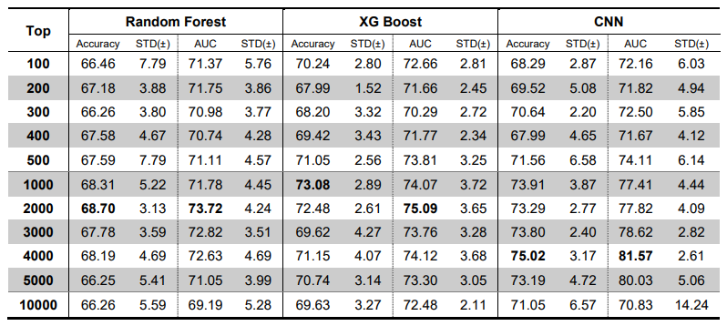

 **[Table 1] Results of classification of AD from CN.** The table shows the number of top SNPs selected based on phenotype influence score for AD classification and the accuracy and AUC of 10-fold cross-validation. Our CNN-based approach yielded the highest accuracy and AUC of 75.02% and 0.8157, respectively, for 4,000 SNPs. In all cases, our CNN models outperformed two traditional machine learning models, Random Forest and XG Boost.

 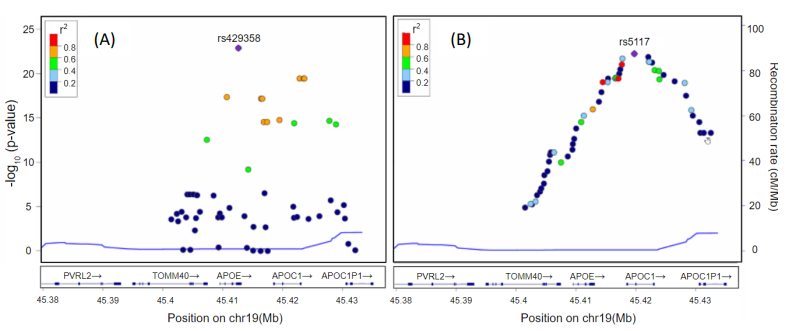

**[Figure5] LocusZoom plots for SNPs located at the 300 kb upstream and downstream region from the boundary APOE gene.** The horizontal axis is the location of SNPs and the vertical axis is -log10 of p-values. Each dot represents a SNP and the color represents the squared correlation coefficient (r2) with the most significant SNP. (A) shows p-values calculated using PLINK and the most significant SNP was rs429358 in *APOE*. (B) shows p-values calculated using our deep learning approach and the most significant SNP was rs5117 in *APOC1*. In (B), we can see linear increase on the left side of rs5117 and linear decrease on the right side of rs5117, which was different from PLINK results (A), which has no linear patterns. In addition, in (B), we can see three strongly correlated SNPs (r2>0.8) with rs5117 on the left side of rs5117 but no SNPs on the right side of rs5117.

 

## Discussion

In this study, we propose a novel deep learning-based approach to select disease-associated SNPs and develop an accurate classification model using high dimensional genome data. We tested our approach using genome-wide genotyping data for Alzheimer’s disease (AD) (N=981). The proposed method successfully identified significant genetic loci for AD that included the well-known AD genetic risk loci. The deep learning based approach outperformed traditional machine learning methods for classification of AD.

The deep learning-based approach for identification of genetic variants consists of three steps. In the first step, we divided the whole genome into non-overlapping fragments with an optimal size. Although deep learning has solved many real-world problems, due to the high dimensionality of the genomic data, few deep learning approaches have been used in GWAS to identify genetic variants and disease classification 22. To our knowledge, this study is the first to develop a deep learning-based method for identifying genetic variants by using a fragmentation and windowing approach. 

In the second step, we calculated a PIS of each SNP within the selected fragments by using an overlapping window and CNN algorithm. Our method calculates PIS, a novel index which is used to find disease-related variants and predict disease. Furthermore, we calculated the z-scores and one-tailed p-values using PIS, which yielded a Manhattan plot showing the most significant genetic loci in *APOE*/*APOC1*/*TOMM40* genes that are known as the strongest genetic risk factors for AD. Our method also identified several novel candidate genetic loci. Sorting nexin (SNX) *14* and *SNX16* on chromosomes 6 and 8, respectively, have not been previously identified to be associated with AD though there may be special relevance for neurodegeneration as *SNX12**63*, *SNX17**64*, *SNX27*65, and *SNX33**66* are involved in neuronal survival. Bicaudal D1 (*BICD1*) on chromosome 12 is a susceptibility gene in chronic obstructive pulmonary disease67 and lissencephaly68, but there are no reports of it being associated with AD. 

In the third step, we selected top SNPs based on PIS to develop classification models for AD. We selected sets of highly AD-related SNPs, and classified AD from CN using CNN and two popular traditional machine learning algorithms, XGBoost and Random Forest. We found the accuracy of classification was changed with the number of the selected SNPs and the classification algorithms. The highest mean accuracy of the classification was 75.0% when CNN was used on the top 4,000 SNPs, which outperformed two traditional machine learning algorithms. It was also 8.3% higher than the accuracy of the classification using only the number of *APOE* ε4 alleles. Classification is the first step toward achieving a better understanding of the genetic architecture of AD. The proposed method will benefit from future studies that use deep learning with quantitative phenotypes and baseline values to predict future disease trajectories.

We plotted the SNPs selected by PIS and PLINK for comparison using LocusZoom. We found that there were no SNPs with r2 greater than 0.8 in the PLINK results, but three strongly associated SNPs were identified using our method. This is because the PLINK method finds statistical significance SNP by SNP, while the approach of deep learning uses multiple inputs to adjust weights through the training process. Deep learning uses adjacent SNPs to compute gradients at every epoch and uses a loss function to adjust the weights in the backpropagation process. Unlike PLINK, our method shows that SNPS related to phenotype can be extracted by considering surrounding SNPs, which means that both methods might be complementary because they identify different variants though notably in the same region around APOE.

In summary, our novel deep learning-based approach can identify AD-related SNPs by using genome-wide data and develop a classification model for AD. The heritability of AD is estimated to be up to 80%. Accordingly, it is important to identify novel genetic loci related to the disease. Using a modest sample size, we found a significant genetic locus and a classification accuracy of 75%. In future work, we plan to apply our method to large-scale whole genome sequencing data sets that are expected to become available soon to identify novel AD-related SNPs and develop more accurate classification models. We also plan to study early stages of disease including mild cognitive impairment and relate variation to quantitative endophenotypes that may be more informative than binary classification.

 

 **조태호** (인디애나대학교 의과대학)

  

> 이 글은 2021년 7월 22일, medRxiv에 업로드된  **Taeho Jo et al. Deep learning-based identification of genetic variants: Application to Alzheimer’s disease classification** 논문을 옮긴 것입니다.   

[논문 바로가기](https://www.medrxiv.org/content/10.1101/2021.07.19.21260789v1)

  