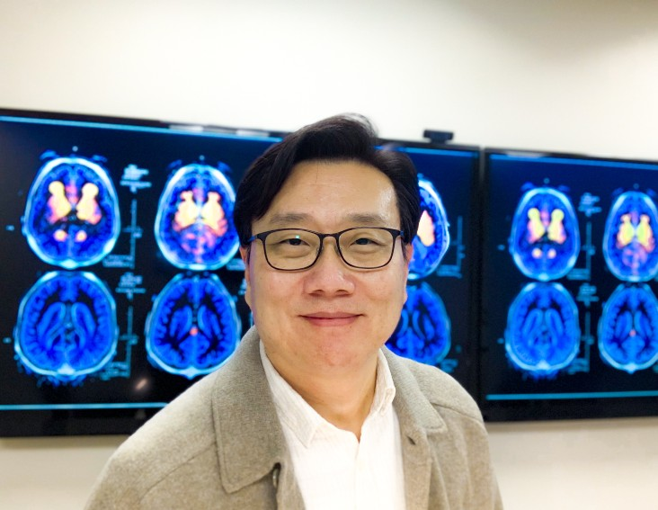

# 13개의 질문과 답

> **커지는 의료 AI 시장 - 한국은 어디까지 왔나**  
> _*질문: 데일리메디 최진호기자 / 답변: 조태호 교수*
  
---

## 목차
1. [의대 진로 선택 계기](#1-처음부터-의대에-목표를-두신-건-아닌-것-같은데-어떤-배경이-있으신-건가요)
2. [의과대학에서 AI 연구 계기](#2-의과대학-교수님이시지만-ai-영역-확장도-눈길을-끕니다-의과대학에서-ai-관련-연구-어떤-계기가-있던-건지요)
3. [알츠하이머 조기진단 연구 수준](#3-ai를-활용한-알츠하이머-조기진단-연구를-하고-계시는-것으로-알고-있는데요-현재-어느-정도-수준까지-갔고-진단을-넘어-예방이나-치료도-향후-가능한-것인지-궁금합니다)
4. [의료 AI의 발전 및 신약 개발](#4-의료영역에서-ai-결합을-말할-때-뉴스에서는-주로-진단-영역이-강조됩니다-의료-ai에는-어떤-것들이-있으며-가장-발전한-부분은-어디인지요-또한-신약-개발-단축에도-역할을-할-것으로-기대되고-있는데요)
5. [국내 vs 해외 의료 AI 기술](#5-국내-의료-ai와-해외-의료-ai-기술은-현재-어느-정도-차이가-있는지-궁금합니다)
6. [각광받는 의료 AI 기술](#6-현재-가장-각광받는-의료-ai-기술에는-무엇이-있으며-선도하는-기업이나-병원은-어디인지요)
7. [연구 협력 및 어려움](#7-교수님-연구-중-국가-기업-병원-간-협력이-이루어지고-있는-부분과-어려운-점은-무엇인가요)
8. [기술적 우려 및 할루시네이션 문제](#8-과거-ai-관련-기업-주가-급등-시-거품설이-있었는데-기술적인-우려는-없는지요)
9. [문제점에 대한 해결책](#9-위에서-언급된-의료-ai의-문제점과-우려에-대한-해결책은-무엇인가요)
10. [의대 증원 문제에 대한 견해](#10-의대-증원-문제로-의정갈등이-계속되고-있습니다-이에-대한-교수님의-견해는-무엇인가요)
11. [산업계, 학계, 정부의 역할](#11-한국의-의료-ai-발전을-위해-산업계-학계-정부는-어떤-역할을-해야-하며-정부-정책에서-제한해-주어야-할-부분은-무엇인가요)
12. [연구 및 개인 계획](#12-업무적-또는-개인적으로-금년-계획에-대해-여쭙습니다)
13. [마지막 말씀](#13-마지막으로-하고-싶은-말씀)

---

## 1. 처음부터 의대에 목표를 두신 건 아닌 것 같은데, 어떤 배경이 있으신 건가요?

  
답변 보기

네, 저는 영문과를 졸업하고 미국계 소프트웨어 회사에 취업하여 첫 사회 생활을 시작했습니다. 당시 맡은 일은 엔지니어 교육과 새로운 버전 출시 지원이었는데, 이 과정에서 기술에 대해 더 깊이 공부해야겠다는 생각이 들었습니다. 마침 박사과정 유학 기회가 열리면서, 저를 받아준 의과대학 내 의료공학과에서 연구를 시작하였고, 지금까지 20년 넘게 이 분야에서 연구해 오고 있습니다.

---

## 2. 의과대학 교수님이시지만 AI 영역 확장도 눈길을 끕니다. 의과대학에서 AI 관련 연구, 어떤 계기가 있었던 건지요?

  
답변 보기

저의 박사과정 테마는 단백질 구조 예측이었습니다. 단백질 구조는 질병 기전과 신약 개발에 매우 중요한데, 복잡해서 컴퓨터 시뮬레이션의 도움이 필요했습니다. 자연스럽게 아미노산 접힘 과정을 연구하게 되었고, 이때 이미지넷 대회에서 딥러닝이 큰 주목을 받았습니다. 이 성과를 보며 AI가 단백질 구조 예측에 새로운 돌파구를 마련할 수 있겠다는 확신이 들었습니다.

2013년 1월, 미주리대학교 지알린 챙 교수 팀에 박사후연구원으로 합류한 후 본격적으로 AI를 적용하는 연구를 진행하여 논문을 발표했습니다. 이는 2021년 노벨상을 받은 알파폴드보다 4년 앞선 연구였으며, 단백질 접힘에 AI 도입 최초 사례로도 주목받았습니다. 그 이후 AI는 제 연구의 가장 중요한 도구가 되었습니다.

---

## 3. AI를 활용한 알츠하이머 조기진단 연구를 하고 계시는 것으로 알고 있는데요. 현재 어느 정도 수준까지 갔고, 진단을 넘어 예방이나 치료도 향후 가능한 것인지 궁금합니다.

  
답변 보기

AI는 입력 데이터에 따라 결과가 달라집니다. 영상의학과에서 처음엔 신경 영상 이미지를 사용하여 뚜렷한 구조적·기능적 변화를 포착, 높은 정확도를 얻었지만 이 방식은 이미 진행된 질병을 의미하기에 더 이른 진단 방법이 필요했습니다.

이에 대사체와 유전체 연구를 시작하였으며, 유전체는 태어날 때부터 정해져 있어 가장 이른 시기에 예후를 예측할 수 있으나, 데이터 차원과 샘플 수 부족 문제를 겪었습니다. 이를 극복하기 위해 자체 알고리즘을 개발했고, 최근 데이터 축적이 활발해져 큰 도움이 되고 있습니다.

현재는 영상, 유전체, 대사물질 데이터를 동시에 활용하여 질병의 조기 발견과 예측 정확도를 높이는 연구를 진행 중입니다.

---

## 4. 의료영역에서 AI 결합을 말할 때, 뉴스에서는 주로 진단 영역이 강조됩니다. 의료 AI에는 어떤 것들이 있으며, 가장 발전한 부분은 어디인지요? 또한 신약 개발 단축에도 역할을 할 것으로 기대되고 있는데요.

  
답변 보기

의료 분야는 전자건강기록, 의료영상, 멀티오믹스, 유전체 등 방대한 데이터를 다루며, 이로 인해 진단, 예측, 신약 개발 등 다양한 분야에서 AI의 필요성이 커졌습니다.

이러한 배경 속에서 AI의 성과는 2024년 노벨상으로 이어졌습니다. 알파폴드를 개발한 데미스 하사비스와 존 점퍼가 데이비드 베이커와 함께 노벨 화학상을 수상했는데, 알파폴드는 전통적 방법으로는 어려운 단백질 구조를 놀라운 정확도로 예측했습니다.

예를 들어, 알파폴드2의 예측 오차는 0.96Å (1Å은 머리카락 굵기의 약 5백만분의 1) 이내로 실제 실험 오차와 유사하며, 구조 데이터와 소스코드 공개를 통해 다양한 변형 및 개선이 진행되어 신약 개발이 크게 단축되고 있습니다.

---

## 5. 국내 의료 AI와 해외 의료 AI 기술은 현재 어느 정도 차이가 있는지 궁금합니다.

  
답변 보기

국내 여러 의료 AI 스타트업 및 협력 기업들을 만나본 결과, 기술 수준은 해외와 비교해도 손색없으나 상용화 속도에서 차이가 있습니다. 이는 임상 도입 전의 신중한 검증 절차, 의료기기 인증, 보험 수가 책정 등 복잡한 규제 요건 때문입니다.

특히 상업성이 낮은 영역(예: 치매 연구)은 정부 주도의 지원이 필수적인데, 미국은 이러한 지원 체계가 잘 마련되어 있습니다.  
한국은 전국민 건강보험과 양질의 데이터 축적이라는 강점을 갖고 있어, 정부 지원과 해외 협력이 강화된다면 국내 의료 AI도 더욱 빠르게 발전할 것으로 기대됩니다.

---

## 6. 현재 가장 각광받는 의료 AI 기술에는 무엇이 있으며, 선도하는 기업이나 병원은 어디인지요?

  
답변 보기

의료 AI의 성공 사례로는 환자 진료에서 의사를 보조하는 시스템이 대표적입니다.  
특히 의료 영상 분석, 생체 신호 모니터링, 전자 건강 기록(EHR)을 활용한 예측 시스템이 주목받고 있습니다.

예를 들어, 듀크대학교에서는 AI 기반 패혈증 조기 경보 시스템을 개발하여 환자의 생체 신호와 검사 결과를 실시간 분석, 증상 발생 36시간 전에 위험을 예측해 패혈증 사망률을 31% 감소시켰습니다.  
또한, 구글 헬스와 베릴리의 당뇨병성 망막병증 진단 AI는 안과 전문의 수준의 정확도를 보여주고 있습니다.  
이처럼 의료 데이터의 디지털화가 빠르게 진행되면서, AI가 의료 현장에서 실질적인 성과를 내며 초기 우려를 해소하고 있습니다.

---

## 7. 교수님 연구 중 국가, 기업, 병원 간 협력이 이루어지고 있는 부분과 어려운 점은 무엇인가요?

  
답변 보기

저희 연구는 주로 알츠하이머 치매를 다루기 때문에, 정부, 기업, 병원의 협력이 필수적입니다.  
인디애나 의과대학은 미국 국립보건원(NIH) 주요 연구 과제를 수주하며 선도적 위치를 차지하고 있으며, 제약회사 일라이 릴리와 정기적으로 협력해 AI 기반 알츠하이머 조기 진단 시스템을 개발하고 있습니다.  
한국에서도 서울대학교 의과대학 알츠하이머병 연구진과 협력하여 실제 환자 데이터를 활용한 연구를 진행 중입니다.  
이 과정에서 데이터 형식과 종류가 다양해 통합이 복잡하고, 미국은 인종 차이로 데이터 해석에 차이가 발생하는 경우가 있으며, 환자 개인정보 보호와 데이터 공유 방안 마련에도 시간이 소요되고 있습니다.

---

## 8. 과거 AI 관련 기업 주가 급등 시 '거품설'이 있었는데, 기술적인 우려는 없는지요?  
*(할루시네이션, 진료 현장에서의 실제 활용 가능성, 의사 대체 논란, AI 활용 시 주의점 등)*

  
답변 보기

과거 AI 기업들의 주가 급등으로 인한 거품설은 기술 발전으로 상당 부분 해소되었으나, 여전히 몇 가지 중요한 과제가 남아 있습니다.  
특히 할루시네이션 문제는 AI가 잘못된 진단을 내릴 가능성을 높여 큰 이슈가 되고 있습니다.  
예를 들어, 뇌 MRI 영상에서 해마 위축이 관찰될 때, 이것이 알츠하이머병의 징후인지, 아니면 고령화, 우울증, 만성 스트레스에 의한 변화인지를 구분하는 것이 매우 중요합니다.  
또한, AI가 의사의 역할을 대체한다는 우려가 있으나 실제 임상에서는 AI가 의사의 판단을 보조하여 의료의 질을 향상시키고 있습니다.  
그러나 AI를 안전하게 활용하기 위해서는 **데이터의 신뢰성**과 **시스템의 투명성**이 필수적입니다.

---

## 9. 위에서 언급된 의료 AI의 문제점과 우려에 대한 해결책은 무엇인가요?

  
답변 보기

테슬라의 자율주행차가 낮은 사고율에도 엄격한 검증과 규제가 필요한 것처럼, 의료 AI도 철저한 검증이 필요합니다.  
AI가 99%의 예측 성공률을 보이더라도 1%의 오진이 환자의 생명에 직결될 수 있으므로, 이를 대비해 **양질의 데이터 확보**가 핵심입니다.  
다양한 임상 데이터를 통해 AI가 충분히 학습하고, 지속적인 검증과 적절한 제도적 규제, 투명한 알고리즘 개발이 병행되어야 합니다.  
결국 AI는 의사의 판단을 보조하는 도구로, 엄격한 검증 절차를 거쳐 의료 현장에 안전하게 도입되어야 합니다.

---

## 10. 의대 증원 문제로 의정갈등이 계속되고 있습니다. 이에 대한 교수님의 견해는 무엇인가요?

  
답변 보기

의대 증원 문제는 매우 복잡합니다.  
의사 부족 상황에서 의대 증원은 필요하지만, 단순히 인원을 늘리는 것만으로는 해결되지 않는 여러 과제가 존재합니다.  
미국의 사례에서도 의대 정원 확대에도 불구하고 의료 인력난이 지속되고 있음을 보여줍니다.  
최근 미국의사협회(AMA)는 전공의 정원 확대, 학자금 지원, 메디케어 지불 개혁 등 실질적인 정책을 제시했습니다.  
의료 서비스의 질 저하와 과중한 업무 부담을 신중히 고려하며, 의대 교육의 질과 의료 서비스 접근성을 동시에 향상시켜야 한다고 생각합니다.

---

## 11. 한국의 의료 AI 발전을 위해 산업계, 학계, 정부는 어떤 역할을 해야 하며, 정부 정책에서 제한해 주어야 할 부분은 무엇인가요?

  
답변 보기

산업계는 기술 개발과 상용화를 위한 투자 및 노력이 필요합니다.  
학계는 AI 기술의 효율성을 검증하고 연구 결과를 공유해야 합니다.  
특히 정부는 연구 및 개발 지원을 아끼지 않으면서, 합리적인 규제와 제도화를 통해 의료 AI의 안전한 임상 도입과 혁신을 동시에 달성할 수 있도록 해야 합니다.

---

## 12. 업무적 또는 개인적으로 금년 계획에 대해 여쭙습니다.

  
답변 보기

제 연구의 초점은 알츠하이머 조기 진단 기술 확립에 있습니다.  
최근 FDA 승인을 받은 알츠하이머 치료제들이 조기 발견을 전제로 하고 있어 연구의 중요성이 더욱 커지고 있습니다.  
치료제 개발은 반가운 소식이지만, 효과를 위해서는 정확한 조기 진단이 필수입니다.  
이 과정에서 AI 기술이 중요한 역할을 할 수 있으며, 방대한 의료 데이터 분석을 통해 알츠하이머 초기 징후를 포착하는 데 큰 도움이 될 것으로 기대됩니다.  
그러나 AI가 실제 임상에서 활용되기 위해서는 의료진과 일반인 모두가 AI의 가능성과 한계를 명확히 이해해야 합니다.  
*모두의 딥러닝*은 한국의 첫 AI 입문서로 7년 넘게 베스트셀러로 자리 잡았으며, 여러 대학에서 교재로 사용되고 있습니다.  
이 경험을 바탕으로 AI의 미래 기술을 쉽게 설명하는 새로운 책을 준비 중이며, 의료 전문가와 AI 개발자, 일반인 간 인식 차이를 좁히는 것이 무엇보다 중요하다고 생각합니다.

---

## 13. 마지막으로 하고 싶은 말씀

  
답변 보기

AI는 의료를 더욱 정교하고 빠르게 발전시킬 수 있는 강력한 도구입니다.  
그러나 이 기술을 안전하고 윤리적으로 활용하기 위해서는 지속적인 논의가 필요합니다.  
AI는 의사의 역할을 대체하기보다는, 의사와 협력하여 더 나은 진료를 제공하는 보조 도구로 발전해야 합니다.  
의료계와 AI 전문가들이 함께 노력하여, AI가 실제 임상에서 사람들의 건강을 지키는 데 기여할 수 있도록 해야 합니다.  
저희 연구실에도 임상 경험이 풍부한 의사가 합류하여 AI를 의료 현장에 도입하기 위한 유전체 연구를 진행 중입니다.  
이러한 연구에 관심 있는 의사, 학생, 연구원 여러분의 연락을 기다리며, 함께 의료 AI 발전을 이끌어가길 희망합니다.

